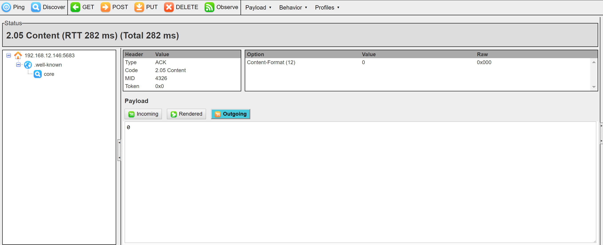
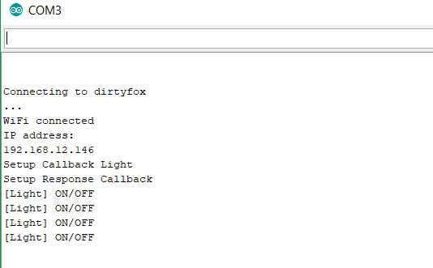
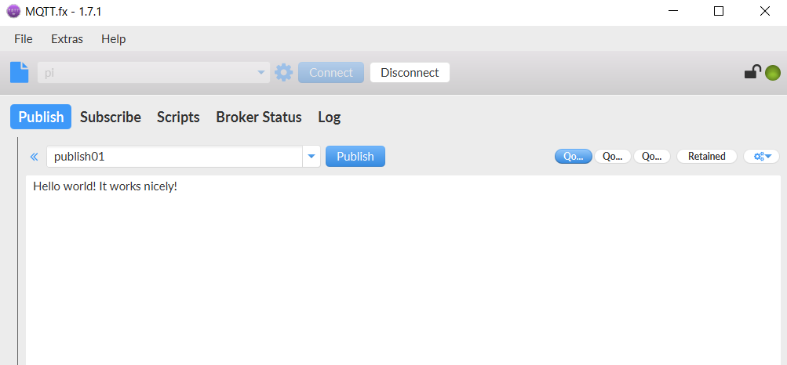
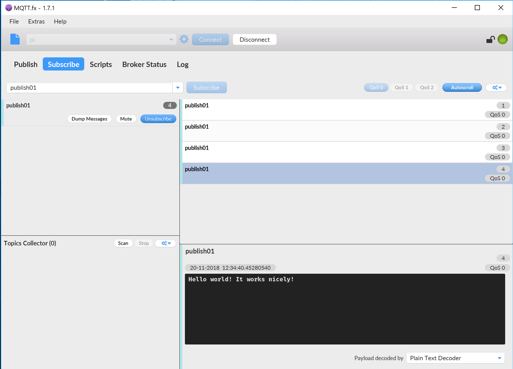
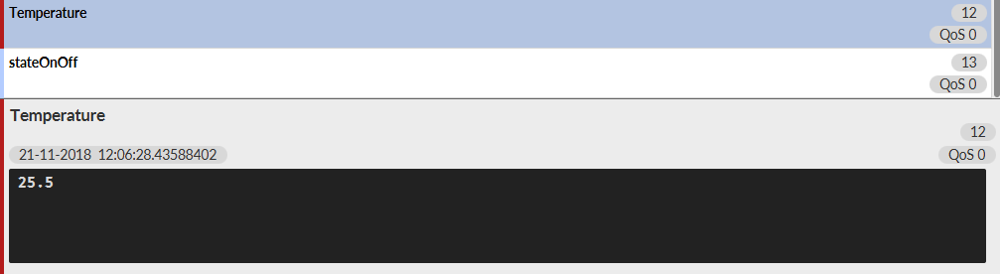
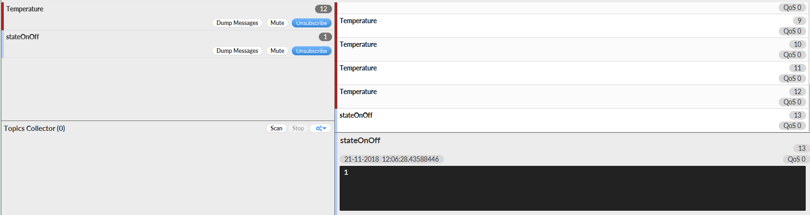

# Exercise #03
### 20.11.2018

##### Lab Outline
* COAP
 – Install simple COAP Arduino library example (use esp32 example, adjust led, and use ESP8266Wifi.h)
 – Explore and switch with Copper4Cr (Chrome developer extension – or old firefox <= 55 with copper extension)
 – Optional: use libcoap binary tools
* MQTT
 – Install mqtt.fx on your laptop
 – Send and receive with mqtt.fx messages to mosquitto (mqtt server) running on pi
 – Build simulators (use your peferred language and mqtt library or consider ulnoiot's integriot in python)
    ● Temperature sensor simulator
   – Start temp, end temp, time to linearly rise
    ● Relay switch (like AC) simulator
   – Showing on and off
    ● Integrator: switch at specific temperature (can be hardcoded)

---

## Aufgaben Paul
Einlesen in ESP32 Example
man kann null oder eins senden

rechere mqtt.fx -> download unter https://mqttfx.jensd.de/index.php/download
mqtt.fx installiert
mqtt profil anlegen (für raspberry) -> 192.168.12.1 -> funktioniert nicht
fehler -> http weg bei ip adresse -> hat funktioniert (via connect)

**MQTT**
Einrichten des Java Workspaces für die Simulatorprojekte
Anlegen eines Java Projektes für Temperatur-Simulator

Temperatur-Simulator schickt laufend Temperaturen zwischen 20 und 30 °C
Siehe [Java Temperatur-Simulator](./java/TemperatureSim)

## Aufgaben Boris
rechere Copper4Cr -> Copper for Chrome -> A Chrome app+extension to browse the Internet of Things
gefunden auf https://github.com/mkovatsc/Copper4Cr -> für chrome
versuche zuerst älteren firefox herunter zu laden und dann copper als plugin zu installieren
copper (CU) plugin installiert-> geht nicht -> coap://coap.me/ oder coap://californium.eclipse.org/ lässt sich nicht eingeben
umstieg auf die chrome variante -> installation mithilfe des readme auf github (https://github.com/mkovatsc/Copper4Cr/blob/master/README.md)
in chrome hat es funktioniert

rechere zu verbindungsproblemen zwischen mqtt und pi -> https://tutorials-raspberrypi.de/datenaustausch-raspberry-pi-mqtt-broker-client/

**MQTT**
Anlegen eines Java Projektes für den On/Off-Simulator

Vorerst nur schicken eines On/Off Werts (0 oder 1)

Erweiterung im Integrierung des Temperatur-Simulators

Siehe [Java OnOff](./java/on_off_simulator)

Auf das Topic "stateOnOff" wird bei Überschreitung von 25 °C eine "1" gesendet

## Aufgaben gemeinsam
Vorbereitungen:Raspberry angeschlossen und hochgefahren -> ESP8266 via usb angeschlossen
CoAP Library suchen für Arduino -> https://www.arduinolibraries.info/libraries/co-ap-simple-library
Wir haben die Library integriert
Examples durchsuchen nach ESP32 -> gefunden -> nun Analyse
neues File erstellt (ESP8266_coap) -> versuchen Teile des Codes von Example einzubinden 

copper for chrome gestartet -> verbinden mit 192.168.12.146 (ESP8266)
Versuchen über copper4cr den raspberry oder den esp8266 anzupingen ->funktioniert nicht 4.04 not found
versuche mit endpoint coap://192.168.12.146:5683/light -> 4.04 not found
fehlersuche, wir wissen nicht wie man sich mit dem esp8266 verbindet
haben jetzt mehrmals das gleiche probiert und nach einigen versuchen hat es funktioniert

Request von Copper

Reaktion von ESP8266 (LED wird dadurch ein/ausgeschalten)

**MQTT**
Anschließend MQTT getestet. Auf beiden Rechnern MQTT.fx installiert und mit Pi verbunden.

Auf einem Rechner wird eine Nachricht gepublished

Auf der anderen Seite wird ein Subscribe zu diesem Thema "publish01" durchgeführt und man erhält Nachrichten

Suchen nach einer Java Library für MQTT -> Eclipse Paho
http://central.maven.org/maven2/org/eclipse/paho/org.eclipse.paho.client.mqttv3/1.2.0/
Download der .jar Datei und Speichern in einem "lib" Verzeichnis

Grundlage ist der Sample Code auf https://www.eclipse.org/paho/clients/java/

Die Projekte werden gemeinsam getestet.

Paul startet das Projekt mit den Temperaturwerten [Java Temperatur-Simulator](./java/TemperatureSim)

Boris startet das Projekt mit dem OnOffSwitch, der bei Überschreitung von 25 °C einen Befehl schickt [Java OnOff](./java/on_off_simulator)

Überschreiten der Temperatur

Daraufhin wird ein Befehl "1" gesendet