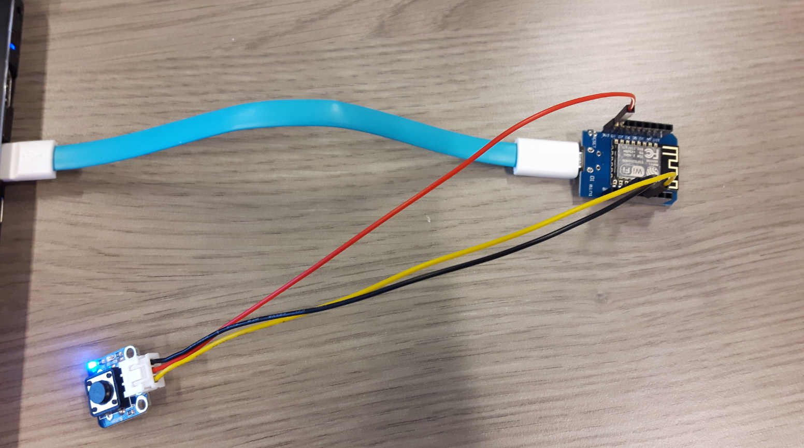
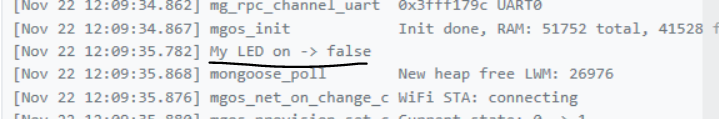
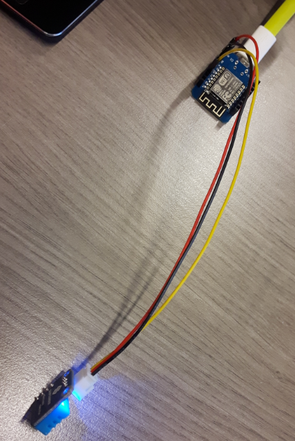
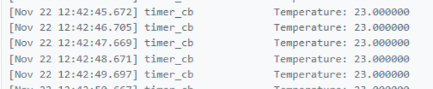

# Exercise #04
### 21.11.2018

##### Lab Outline
* MongooseOS
  * Build system: Read and write GPIO (implement in hardware)
  * Advanced tutorial: temperature sensor
  * Optional: Connect to local MQTT server
* **HW**, watch: https://www.youtube.com/watch?v=uOrLOgsCpNE and add to portfolio answers to:
  * What is fog computing?
  * What is the edge (regarding IoT)?
  * What are the different categories of the presented open source frameworks?
  * Which framework did you like best and why?

---

## Aufgaben Paul
For **HW** see portfolio notes [here](../../schmutz/portfolio/schmutz_portfolio.md) @Session #04 > Exercise #04 > Homework.

## Aufgaben Boris


## Aufgaben gemeinsam
## Basic tutorial
Aufbau:


Herunterladen von Mongoose https://mongoose-os.com/docs/quickstart/setup.md

Bauen eines Button Systems:

<span style="color: red;">BILD</span>


Nach Anschließen des ESP8266 an den PC wird MOS gestartet:


Sample App01 laden und richtiges Board auswählen:


Mit folgendem Befehl

```
mos build
```

wird ein Build für das Projekt für ESP8266 erstellt.


Danach wir die erstellte Firmware auf den ESP8266 geflasht (über den ausgewählten COM Port):

```
mos flash
```


WLAN einrichten:


Auf <https://dash.mongoose-os.com/> wird ein neues Device angelegt:


Der Token wird kopiert und mittels MOS konfiguriert:


Das Device ist nun online:


Einladen senden auf Mobile Devices:
boris.fuchs89@gmail.com

Steuerung des Geräts ist nun auf dem Smartphone möglich
LED kann mittels Toggle gesteuert werden


Ändern von Source-Code, zB wird folgendes geändert (LED on --> My LED on):

```javascript
let setLED = function(on) {
  let level = onhi ? on : !on;
  GPIO.write(led, level);
  print('My LED on ->', on);
};
```


Mit mos build wird ein neuer aktualisierter Build erstellt.

Über dash.mongoose-os.com > OTA update selected > fw.zip auswählen



## Advanced tutorial
Aufbau:


~~~
mos clone https://github.com/mongoose-os-apps/empty app2
~~~

Library für Temperatursensor hinzufügen
mos.yml
  - origin: https://github.com/mongoose-os-libs/dht


Konfiguration einrichten:
mos.yml
config_schema:
   - ["app.pin", "i", 5, {title: "GPIO pin a sensor is attached to"}]

Code in main.c einfügen:
~~~C
#include "mgos.h"
#include "mgos_dht.h"

static void timer_cb(void *dht) {
  LOG(LL_INFO, ("Temperature: %lf", mgos_dht_get_temp(dht)));
}

enum mgos_app_init_result mgos_app_init(void) {
  struct mgos_dht *dht = mgos_dht_create(mgos_sys_config_get_app_pin(), DHT11);
  mgos_set_timer(1000, true, timer_cb, dht);
  return MGOS_APP_INIT_SUCCESS;
}
~~~

Mit mos build und mos flash wird es auf den ESP8266 gespielt.
Fehler zuerst: Temperaturwerte von ca. 640 wurde geliefert. Das lag an der Wahl von DHT22 wie es im Online Tutorial verwendet wurde. Jedoch handelt es sich in unserem Fall um einen DHT11, weswegen wir diese Zeile in der main.c anpassten.

Ergebnis:
