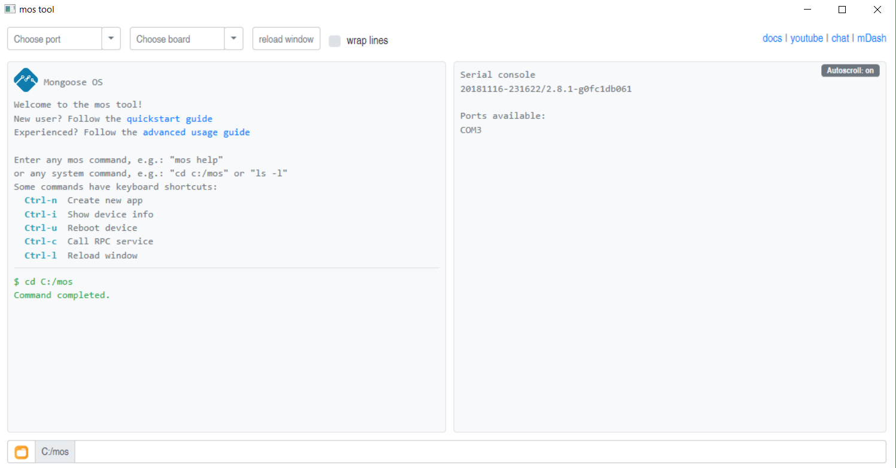
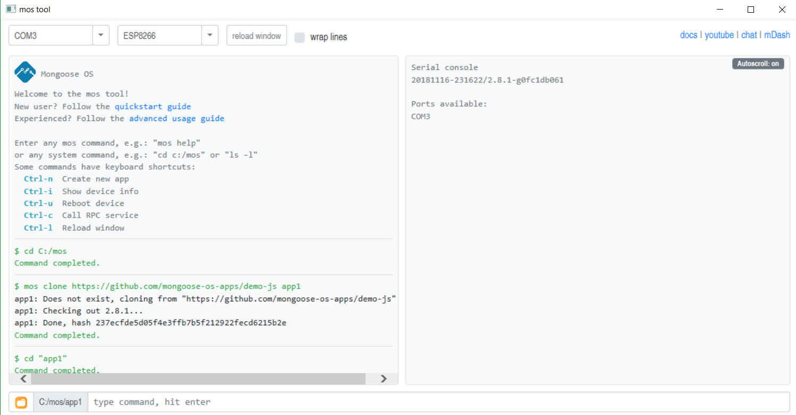
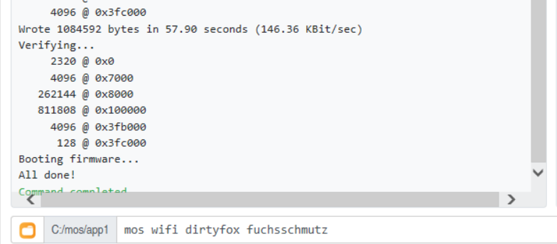
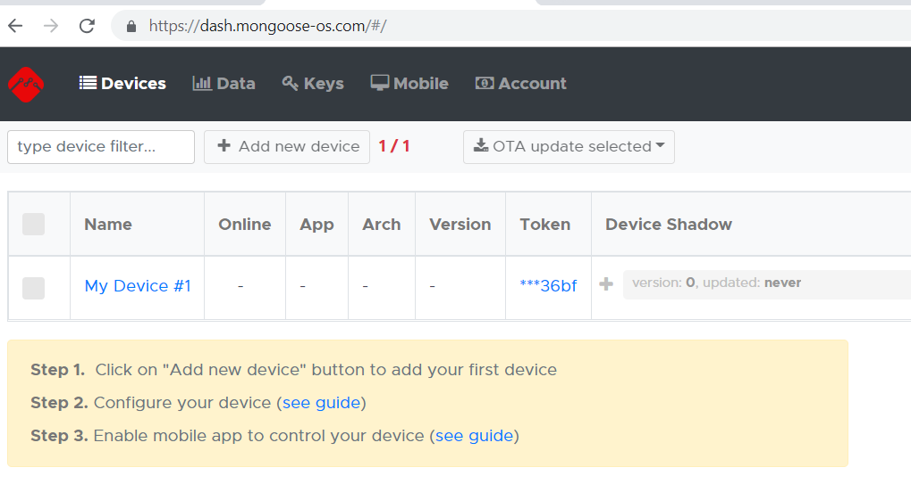
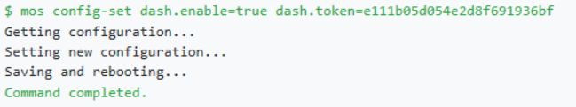
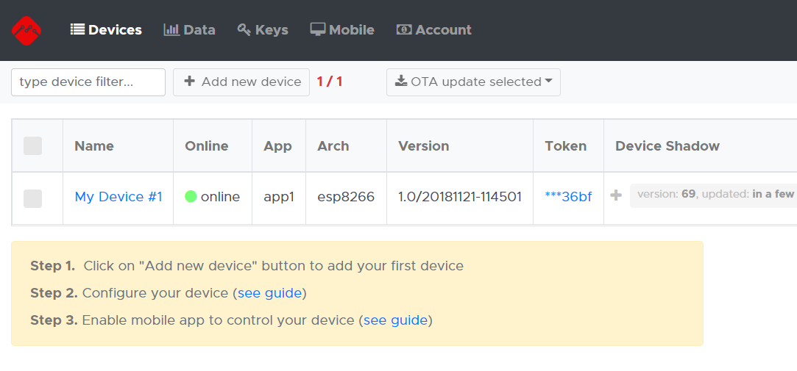

# Exercise #04
### 21.11.2018

##### Lab Outline
* MongooseOS
  * Build system: Read and write GPIO (implement in hardware)
  * Advanced tutorial: temperature sensor
  * Optional: Connect to local MQTT server
* **HW**, watch: https://www.youtube.com/watch?v=uOrLOgsCpNE and add to portfolio answers to:
  * What is fog computing?
  * What is the edge (regarding IoT)?
  * What are the different categories of the presented open source frameworks?
  * Which framework did you like best and why?

---

## Aufgaben Paul
For **HW** see portfolio notes [here](../../schmutz/portfolio/schmutz_portfolio.md) @Session #04 > Exercise #04 > Homework.

## Aufgaben Boris


## Aufgaben gemeinsam
Herunterladen von Mongoose https://mongoose-os.com/docs/quickstart/setup.md

Bauen eines Button Systems:

BILD


Nach Anschließen des ESP8266 an den PC wird MOS gestartet:




Sample App01 laden und richtiges Board auswählen:




Mit folgendem Befehl

```
mos build
```

wird ein Build für das Projekt für ESP8266 erstellt.


Danach wir die erstellte Firmware auf den ESP8266 geflasht (über den ausgewählten COM Port):

```
mos flash
```


WLAN einrichten:




Auf <https://dash.mongoose-os.com/> wird ein neues Device angelegt:




Der Token wird kopiert und mittels MOS konfiguriert:




Das Device ist nun online:




**Next exercise continue at https://mongoose-os.com/docs/quickstart/setup.md#9-enable-mobile-app**


