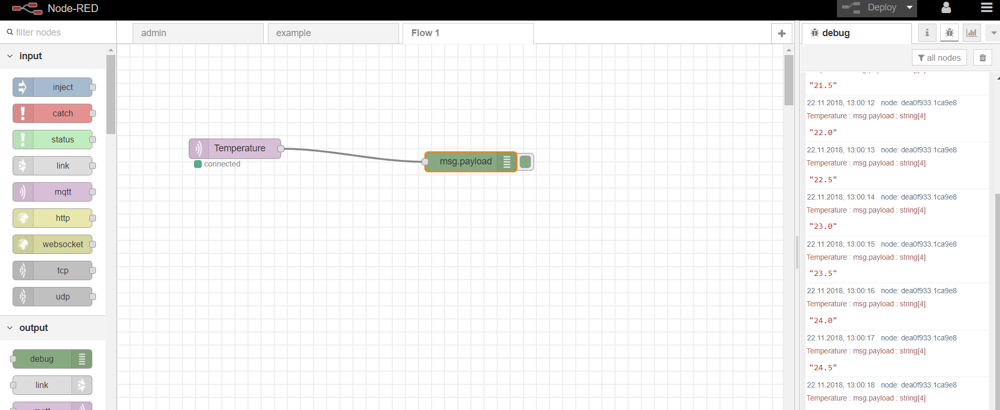
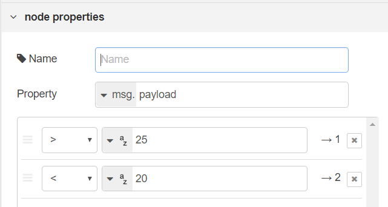
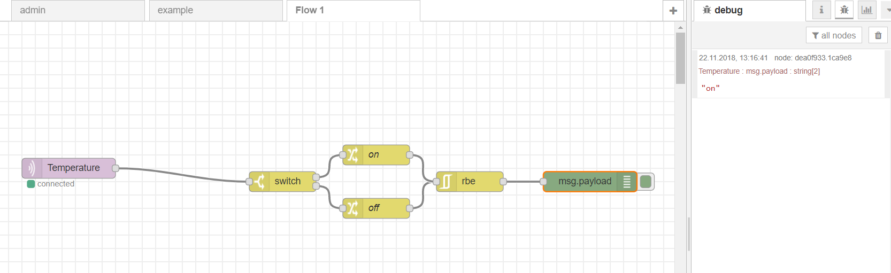

# Exercise #05
### 22.11.2018

##### Lab Outline
* NodeRed
  * Build system: Read temperature sensor and react (use MQTT simulators)

---

## Aufgaben gemeinsam
* Einsteigen auf https://192.168.12.1 > Node-RED
* Einloggen mit user: ulnoiot und password: iotempire
* Neuen Flow anlegen
* Einfügen von mqtt input node für MQTT Topic "Temperature" und einem Debug Node zum testweisen Ausgeben der Daten
* Deploy
* Anschließend wird die Temperatursimulation von exercise3 gestartet (siehe [hier](../ex03/java/TemperatureSim/src/at/fhhgb/mc/iot/ex03/Main.java))
* Vorläufiges Zwischenergebnis:

* Um auf einen Temperatur-Umbruch zu reagieren, wird ein switch node eingefügt
  * größer 25 °C --> Ausgang 1
  * kleiner 20° C --> Ausgang 2

* Die Ausgänge werden jeweils mit change nodes verknüpft, damit die payload auf entweder "on" oder "off" gesetzt wird
* Um mehrfache Werte zu vermeiden und nur Änderungen festzustellen, werden die Ausgaben der beiden change nodes auf einen rbe node geleitet.
* Das System gibt nun bei Werten >25 "on" aus und bei Fallen der Werte <20 "off"

