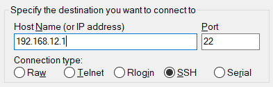
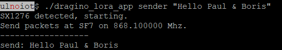

# Exercise #09
### 04.12.2018

##### Lab Outline
* LORA
  – Setup Lora shield on Pi (careful!)
  – Install and run example 3 from http://wiki.dragino.com/index.php?title=Lora/GPS_HAT
  – Pair up with another team. Exchange messages (one direction per test, test both)
  – Modify example to make single connections and support longer messages
  – Integrate into node-red and be able to receive and send text messages there (use exec node and modify /etc/sudoers)
● Try for (at least) 1.5 hours to setup either (document all problems!)
  – TTN
    ● Activate LORA/TTN connection on pi (single channel server)
    ● Send from other pi something to TTN
  – Lora Server
    ● Setup the server
    ● Send something from other pi to server

---

## Aufgaben Paul

## Aufgaben Boris

## Aufgaben gemeinsam

### installation von example 3 (http://wiki.dragino.com/index.php?title=Lora/GPS_HAT)
* ausführen vom git-repository auf dem raspberry
* wget -> unzip master -> dragino_lora_app make -> sender 
* versuchen nachricht an kollegen zu schicken und welche zu empfangen (sender "test dirty fox")
* ulnoiot hängt sich auf wenn wir das sender kommando eingeben, es sendet zwar die nachricht korrekt, kann aber nicht mehr beendet werden -> steigen um auf putty 

* versuchen nachrichten zu empfangen -> "rec" -> kommen an (doch einige nachrichten von kollegen fehlen) -> beim "res" kommando sind dann alle da
* die nachricht die wir schicken, schicken wir permanent (können das nicht mehr beenden) -> fahren den raspberry herunter
* neustart raspberry -> jetzt funktioniert alles

### Modify example to make single connections and support longer messages

* wir arbeiten mit einem anderen team zusammen (tobias stadler und markus seiberl); wir programmieren den receiver
* bearbeiten der main.c -> boolean receive(char *payload) -> 

for(int i = 0; i < receivedCount; i++)
{
   payload[i] = (char)readReg(REG_FIFO);
}
payload[receivedCount] = '\0'; //DAS HIER

* Damit Sender nicht die ganze Zeit sendet:

//while(1) {
	txlora(hello, strlen((char *)hello));
//delay(5000);
//}

### Integrate into node-red and be able to receive and send text messages there (use exec node and modify /etc/sudoers)

* visudo -> /etc/sudoers (anders könne wir das file nicht bearbeiten) -> später

#### LORA sender (node red)
* node red -> sender node (exec node) -> test -> funktioniert (kollegen empfangen die nachricht)
* text input -> auf funktion (save msg) -> msg wird global gespeichert -> dann per buttonpress auf sender node ->  test mit "hello i am paul" -> geht nicht (error 127)

* wir schaffen es nicht die msg.payload korrekt an unseren sender node zu schicken -> bauen jetzt das komplette kommando vor dem sender node zusammen und übergeben ihm dann alles
* funktiniert soweit, aber er sendet immer die alte nachricht -> button wird weggelassen -> nur mehr mit enter wird gesendet
* Sender node -> msg.payload = "/home/ulnoiot/rpi-lora-tranceiver-master/dragino_lora_app/dragino_lora_app sender '" + msg.payload + "'";

#### LORA receiver (node red)

* button node -> dann auf exec node (receiver node) -> dann debug node -> test: geht nicht, bekommen keine nachrichten

printf("Packet RSSI: %d, ", readReg(0x1A)-rssicorr);
printf("RSSI: %d, ", readReg(0x1B)-rssicorr);
printf("SNR: %li, ", SNR);
printf("Length: %i", (int)receivedbytes);
printf("\n");
printf("Payload: %s\n", message);
fflush(stdout); //HINZUGEFÜGT

* bekomme die nachrichten jz

#### LORA Server

* versuchen lora server zu installieren (auf pi) ->

sudo apt install mosquitto mosquitto-clients redis-server redis-tools postgresql 
sudo -u postgres psql

create role loraserver_as with login password 'admin';
create role loraserver_ns with login password 'admin';
create database loraserver_as with owner loraserver_as;
create database loraserver_ns with owner loraserver_ns;
\c loraserver_as
create extension pg_trgm;
\q

sudo apt install apt-transport-https dirmngr
sudo apt-key adv --keyserver keyserver.ubuntu.com --recv-keys 1CE2AFD36DBCCA00
sudo echo "deb https://artifacts.loraserver.io/packages/2.x/deb stable main" | sudo tee /etc/apt/sources.list.d/loraserver.list
sudo apt update

sudo apt install loraserver
# start loraserver
sudo systemctl start loraserver

# start loraserver on boot
sudo systemctl enable loraserver

sudo journalctl -f -n 100 -u loraserver

/etc/loraserver/loraserver.toml -> EU868 configuration example

