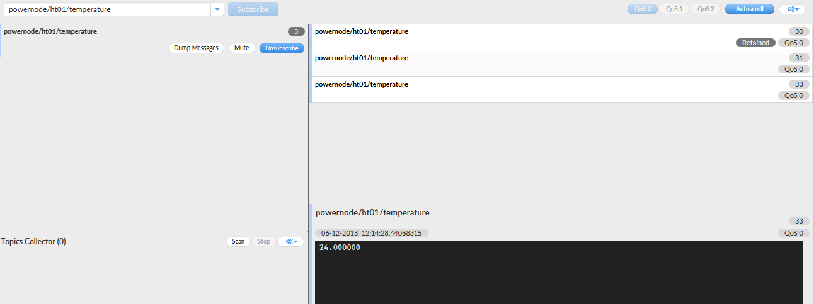
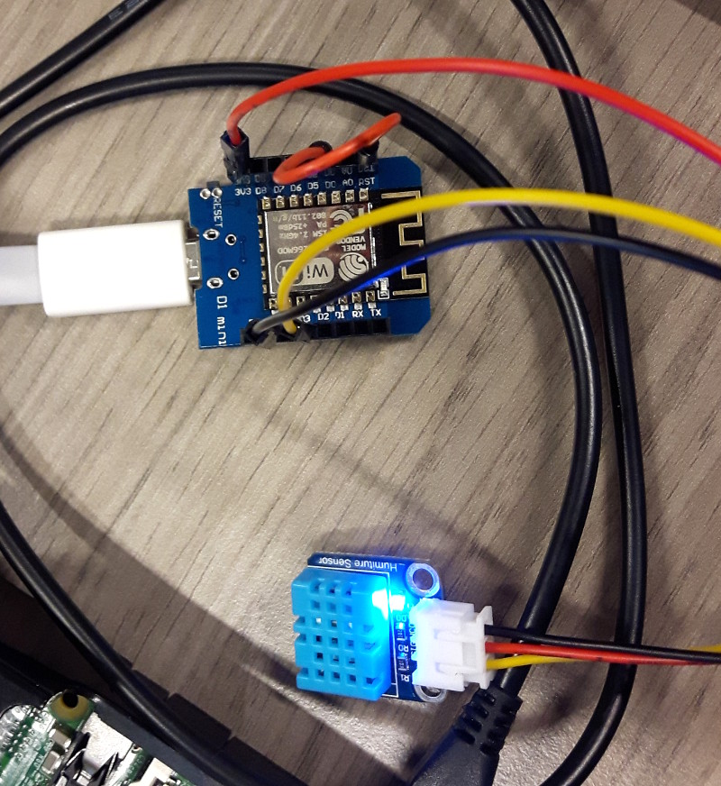
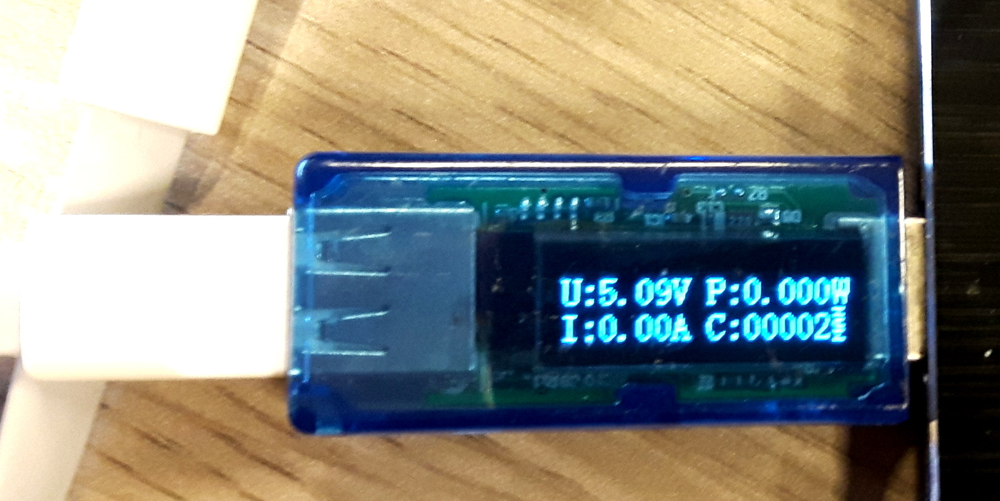
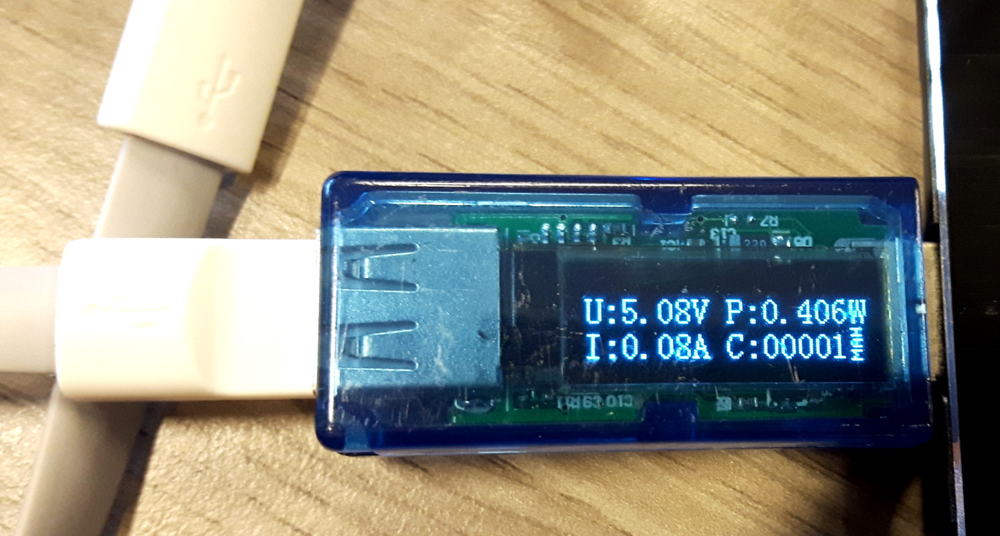

# Exercise #09
### 06.12.2018

##### Lab Outline
● Build temperature power- management sensor
with ulnoiot
● Finish LORA experiments from last lab
● Build team with 4-8 persons (take time to match)
– If you are more than 5 persons, elect a leader (product
owner) and a logistics master (scrum master)
– present ideas/scenarios to each other
● Design scenario(s) and ideas for project 3

---

## Aufgaben Paul

## Aufgaben Boris

## Aufgaben gemeinsam

### Power Management

ESP8266 flashen mit UlnoIoT

Node Name: powernode

temperature (+ humidity) sensor anschließen auf D3

2x upgraden --> ulnoiot upgrade

setup.cpp

~~~c++
void start() {
    dht11(ht01, D3);
    
    //Fall asleep in 30s, wake up again in 10s
    deep_sleep(30000, 10000);
}
~~~

Probiert => geht nicht, Compile error in einem Python Skript

Nur dht11(th01, D3) in setup.cpp gelassen, ESP8266 reset gedrückt, neu deploy => geht:

Code abändern:

~~~c++
dht11(ht01, D3);

void start() {   
    //Fall asleep in 30s, wake up again in 10s
    deep_sleep(30000, 10000);
}
~~~

geht eine Zeit lang und sendet dann keine Daten mehr

neue Verkabelung:

Funktioniert nun. Schickt 30 Sekunden MQTT Temperatur Nachrichten, dann sleep 10 Sekunden lang. Dann wird erneut aktiviert und schickt über MQTT wieder 30 Sekunden Temperatur Nachrichten usw.

Mit Überprüfung des Stromverbrauchs kann dies überprüft werden.

Im Sleep mode:

Im Regular mode:

### Proj03

#### Team

* Boris Fuchs & Paul Schmutz
* Annika Seibezeder & Simon Angerbauer
* Roman Socovka & David Mitterlehner

#### Gemeinsame Notizen

Smart Home

Themenfindung
Offene Türe/Fenster- Detektor
Dashboard zeigt an, ob und welche Fenster/Türen im Eigenheim offen bzw. geschlossen sind
Security
Haustür schließt automatisch wenn man das Haus verlässt
Lichtschranke → Alarm beim Durchgehen und Einschalten einer Kamera, Video wird auf Monitor live übertragen + Benachrichtigung auf Handy
Detektion von geöffneten Türen/Fenster
Haustiere
Automatische Öffnung der Katzenklappe
Nachfüllen der Wasserschüssel für Hund
Leckerlie-Dispenser mit Hundecam
Garagentor automatisch öffnen
Anforderungen:
Lichtschranke vor Garage aktiviert
Handy ist mit lokalem WLAN verbunden

Benötigte Sensoren/Aktoren:
Offene Türen/Fenster
Photointerrupter oder ReedSwitch + eingebauter Magnet
Security
Servomotor (Entriegeln der Haustür)
Presence detection mit Handy in WLAN + Node RED
Raspberry Kamera
Laser Emitter + Photoresistor (=Lichtschranke)
Active Buzzer
Button (Alarmanlage ein/aus)
RGB LED (Status Alarmanlage)
Haustiere
Reed Switch (Katzenklappe)
Mini-Magnet (Katze)
Servomotor (Entriegeln der Katzenklappe)
Ultrasonic Sensor (Wasserstand Schüssel)
Garagentor
Servomotor (Öffnen des Tors)
Laser Emitter + Photoresistor (=Lichtschranke)

Rollen
Product Owner:
Scrum Master: 

Szenario

Max Mustermann hat ein großes Haus mit einer Garage für seinen BMW. Er besitzt auch zwei Hauskatzen. Um sich wiederholende Tätigkeiten zu vermeiden, möchte er seine Residenz in ein “Smart Home” umwandeln. Auch um die Sicherheit ist er besorgt, deswegen soll eine ausführliche Alarmanlage installiert werden, einerseits für die Überwachung mittels Videoaufzeichnung und das Kontrollieren, ob alle Fenster und Türen geschlossen sind, andererseits sollen sicherheitsrelevante Tätigkeiten automatisch ausgeführt werden, wie z.B. das Schließen der Haustüre beim Verlassen. Folgendes Szenario ereignet sich nun im Tagesablauf von Max:
Um 7:00 Uhr steht Max auf und bereitet sich auf den Tag vor. Er richtet sich im Badezimmer her und zieht sich an, um das Haus zu verlassen. Beim Verlassen des Hauses aktiviert sich ein Elektromotor, der einen Schranken so dreht, dass er die Türe blockiert. Danach begibt sich Max zur Garage, um in seinen BMW einzusteigen. Sobald er die Lichtschranke mit seinem Körper blockiert, öffnet sich die Garage, ebenfalls über einen Elektromotor. Dies geschieht allerdings nur, wenn Max zusätzlich mit seinem Handy im lokalen WLAN Netz ist, als Sicherheitsmaßnahme.

