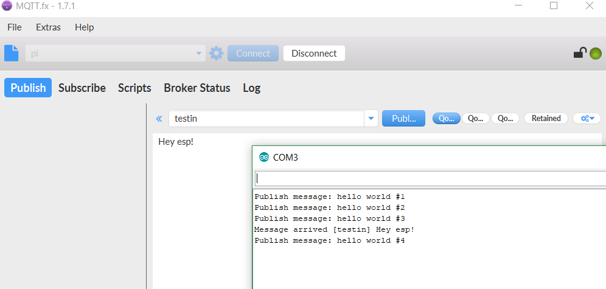
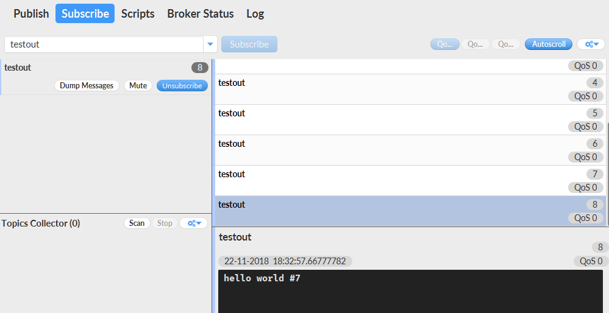
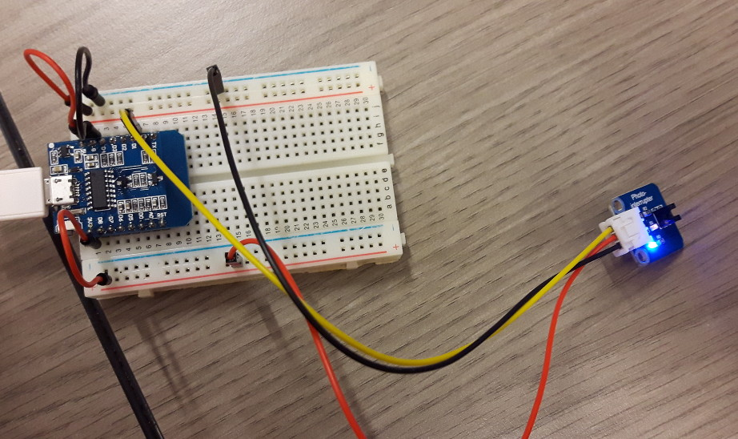
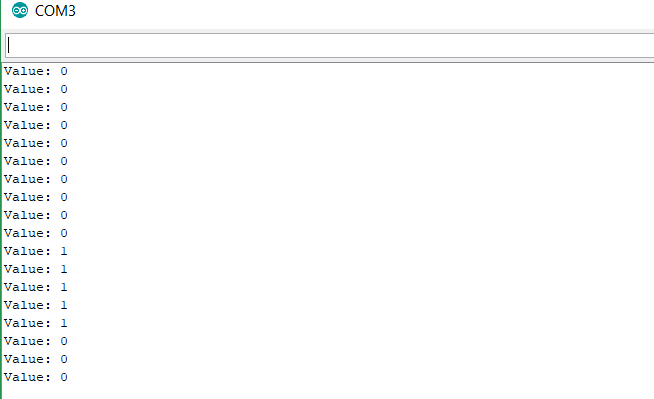
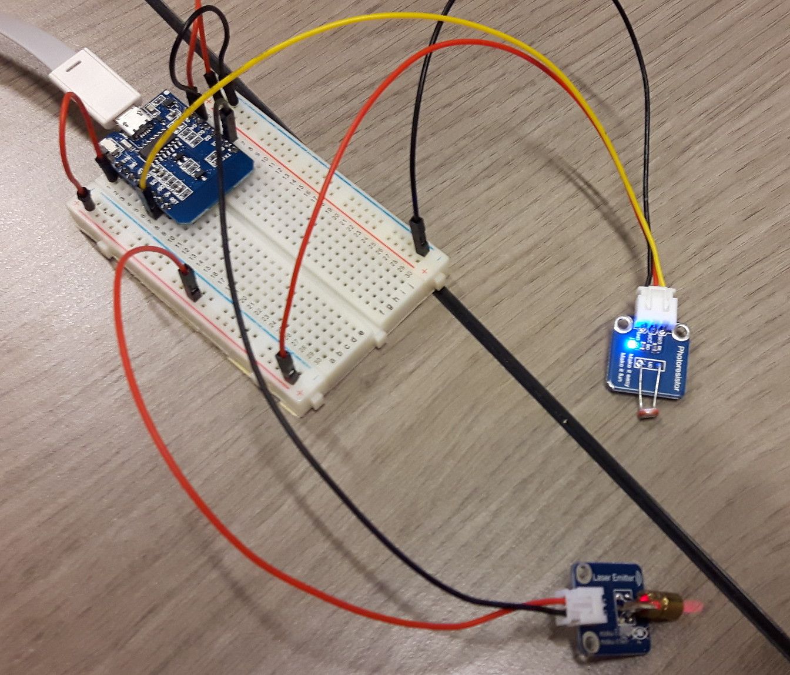
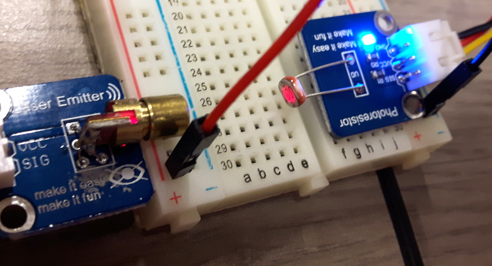
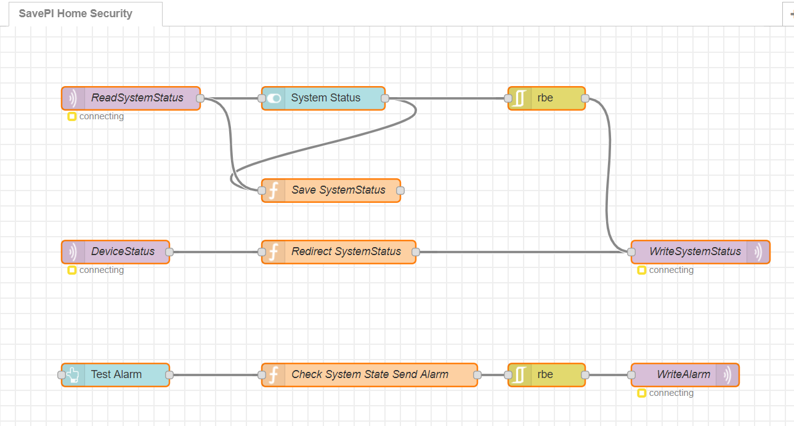
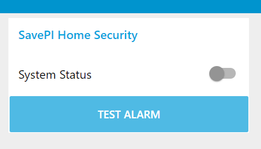
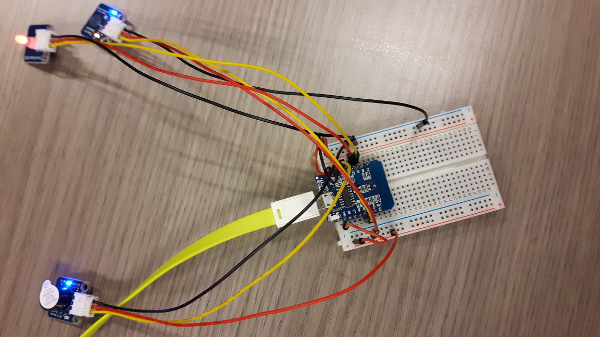

# Project #01
### 21.11.2018

##### Lab Outline
* Present working system with 2-3 Wemos and gateway (the use of mqtt is obligatory, no direct communication between nodes!) using all (and more) what we have explored so far
* Use custom integrator or Node-RED
* Make use of 3 different sensors and two actors
* Design a scenario (giving this project a frame and being able to play through it in 5 minutes)
---

## Aufgaben gemeinsam

### Thema des Project #01 als Story

#### SavePI Home Security

**Max** ist begeisterter IoT Hardware Bastler. Nachdem in seinem Stadtviertel in letzter Zeit in der Nacht oft unbekannte Menschen umherstreifen und sogar eingebrochen wurde, beschließt Max, sich zur Erhöhung seiner Sicherheit im Worst-Case eine Alarmanlage zu bauen. Er tauft sein Alarmanlagen-System **SavePI Home Security**.

Eines Abends geht Max ins Schlafzimmer, wo seine Alarmanlagenzentrale eingerichtet ist. Vor dem Schlafen aktiviert er mit einem **Button** die Alarmanlage. Er vergewissert sich, dass sie aktiv ist, indem er auf die **LED** schaut. Diese leuchtet grün, was eine aktive Alarmanlage bedeutet. Mit einem Gefühl der Sicherheit legt sich Max schlafen.

Um 04:00 Uhr morgens schläft Max gerade tief und fest. Was er jedoch nicht weiß, ist, dass **Udo**, ein gefürchteter und bisher ungefasster Serien-Einbrecher, zu seinem Haus unterwegs ist. Udo geht zum Fenster an der Straßenseite von Max' Haus und macht sich mit einem Brecheisen ans Werk. Max hat am Fenster einen **Sensor** montiert, der beim Öffnen des Fensters Alarm schlägt. Leider hat am Vortag Max' Katze mit den Kabeln des Sensors gespielt, wodurch dieser nun nicht mit Strom versorgt ist. Udo öffnet das Fenster und es wird kein Alarm ausgelöst. Der Einbrecher kann somit in den Vorraum des Hauses eindringen.

Natürlich hat Max an eine zweite Absicherung des Systems gedacht. Eine **Lichtschranke** im Korridor soll beim Durchschreiten ebenfalls einen Alarm auslösen. Max hat Glück. Die Lichtschranke ist voll funktionsfähig. Udo, der Einbrecher, öffnet die Tür vom Vorraum in den Korridor, um näher an mögliche Wertsachen zu gelangen. Dabei betritt er den Korridor und unterbricht dadurch die installierte Lichtschranke.

Sofort wird ein Alarm ausgelöst. Am Korridor beginnt ein **Lautsprecher** mit ohrenbetäubendem Getöse zu erschallen. Max wird sofort von diesem Lärm wach und sieht, dass die **LED** der Alarmanlage im Schlafzimmer rot leuchtet - das bedeutet Alarm. Udo ist völlig überrascht durch den plötzlichen Klang des Lautsprechers. Max ruft sofort die Polizei und verlässt das Schlafzimmer, um nach dem Eindringling zu sehen. Udo, immer noch verblüfft, stellt sich freiwillig und Max gelingt es, ihn bis zum Eintreffen der Polizei festzuhalten. Udo ist gefasst.

Nachdem die Polizei den Serien-Einbrecher weggebracht hat, geht Max zurück ins Schlafzimmer. Er drückt den **Button** und der **Lautsprecher** ist aus und die **LED** leuchtet nicht mehr - der Alarm ist deaktiviert. Inzwischen ist es 05:30 Uhr und Max wäre nun ohnehin aufgestanden. Nach Abklären mit der Versicherung wird ein neues Fenster montiert und Max stellt die richtige Verkabelung des Sensors sicher.

Das System ist wieder voll einsatzbereit und Max setzt auch in Zukunft auf die Sicherheit, die sein Alarmanlagen-System gewährleistet.

## Aufgaben Paul

### MQTT für MSP8266

Recherche für MQTT für MSP8266

Download von MQTT Client Library: https://github.com/knolleary/pubsubclient/releases/tag/v2.7

pubsubclient-2.7.zip Datei in Arduino IDE als Library hinzufügen

Sample Code auf https://github.com/knolleary/pubsubclient/blob/master/examples/mqtt_esp8266/mqtt_esp8266.ino testen

In folgenden zwei Bildern wird dargestellt, dass die Funktionsweise der MQTT Messages aufrecht ist:

### Photointerrupter

Siehe Sample Programm [hier](./code/PhotoInterrupterDemo/PhotoInterrupterDemo.ino)

Diese Komponente soll simulieren, dass bei einem Fenster festgestellt werden kann, wann es geöffnet wird, indem das Herausnehmen (=Öffnen des Fensters) aus dem Schranken detektiert wird.

**Aufbau in Hardware:**

Beispielsweise könnte mit Papierstreifen nun der Schranken unterbrochen werden. Bei Unterbrechung wird eine 1 gesendet, wenn nicht, dann 0:

### Laser Emitter und Photo Resistor

Dieser Aufbau dient als eine Art Bewegungsmelder. Wenn die Lichtschranke unterbrochen wird, weißt das auf eine Person hin, die an dieser Stelle durch den Laserstrahl geht.

Siehe Sample Programm [hier](./code/LaserEmitterPhotoResistorDemo/LaserEmitterPhotoResistorDemo.ino)

**Aufbau in Hardware:**

Laser Emitter funktioniert mit DigitalWrite LOW. Das Gerät funktioniert mit 3V sowie mit 5V (mit 5V deutlich kräftigerer Laser-Strahl).

Photo Resistor funktioniert mittels AnalogRead

Wird mit dem Laser darauf geleuchtet, erhält man niedrige Analogwerte. Sobald das Licht vom Laser weg ist, steigt der gelesene Wert. Dies kann mit dem SerialPlotter in Arduino festgestellt werden. Hier eine Darstellung, wie vorgegangen wird:

Am Serial Plotter kann folgende Veränderung beobachtet werden. Wird der Laser abgewendet, steigen die Werte. Ansonsten bleiben sie niedrig:

### Security Devices

Ein Aufbau auf einem ESP8266 dient dazu, um einen Alarm festzustellen und über MQTT zu versenden.

Folgende Geräte werden dazu verwendet:

* Photoresistor
* Photointerrupter
* Laser Emitter

Der Aufbau und die Funktionsweise wurde oben bereits erläutert.

Siehe [Code](./code/MQTT_SecurityDevices/MQTT_SecurityDevices.ino)

### Node-RED Integrator

#### *Optional*: node-red-dashboard für lokalen PC

Vorweg: Falls Node RED lokal ausgeführt wird und Elemente wie ui_button fehlen --> folgendes Package installieren:

~~~
npm install node-red-dashboard. 
~~~

Anschließend in $HOME/.node-red/settings.js:

~~~javascript
// If you installed the optional node-red-dashboard you can set it's path
// relative to httpRoot
   ui: { path: "ui" }, //remove comment '//' at the beginning of this line
~~~

Im Browser kann anschließend über http://127.0.0.1:1880/ui auf die Oberfläche zugegriffen werden (Node-RED zuvor im Terminal mit "node-red" starten).

---

#### MQTT

Für das SavePI Home Security System gibt es 3 wichtige MQTT Topics:

* systemstatus
* devicestatus
* alarm

##### systemstatus

Dieses Topic gibt an, ob die Alarmanlage ein- oder ausgeschalten ist. 0 bedeutet aus, 1 bedeutet ein.

##### devicestatus

Geräte, die sich gerade auf den Gateway verbinden und Teil der Alarmanlage werden, wissen vorerst nicht Bescheid, ob die Alarmanlage aktiv ist. Deswegen, schickt jedes Gerät (zB ein ESP8266 mit mehreren anderen angeschlossenen Geräten) gleich nach der Verbindung mit dem Gateway eine "hello" Message auf dem Topic "devicestatus". Der Node-RED Integrator reagiert darauf und sendet über das Topic "systemstatus" den Status der Alarmanlage an alle Geräte aus.

##### alarm

Auslöser der Alarmanlage sind Geräte, die einen Alarm feststellen können. Falls dieser Fall eintritt, wird am Topic "alarm" eine 1 gesendet, die einen Alarm bedeutet.

#### Übersicht

Der Integrator ist folgendermaßen aufgebaut:

**ReadSystemStatus**

Liest über MQTT das Topic "systemstatus" ein (kann von einem Gerät über einen Button angesteuert werden). Der Status (0 oder 1) wird für den grafischen Switch "System Status" übernommen.

**System Status**

Grafischer Button für die Steuerung des Systemstatus über die Node-RED UI (siehe unten Node-RED UI).

**Save SystemStatus**

Diese Funktion speichert im globalen Kontext den Status der Alarmanlage.

~~~javascript
if (msg.payload === '1') {
    msg.payload = '1';
} else {
    msg.payload = '0';
}
global.set('state', msg.payload);
return msg;
~~~

**WriteSystemStatus**

Sendet eine MQTT Message auf dem Topic "systemstatus" und leitet somit das Ein- und Ausschalten mit dem grafischen Switch (siehe Node-RED UI) an alle Geräte weiter.

**DeviceStatus**

Empfängt MQTT Nachrichten von Geräten. Die Geräte schicken dabei nur eine "hello" Message auf dem Topic "devicestatus".

**Redirect SystemStatus**

Falls ein Gerät eine "hello" Message schickt, heißt das, dass es den Status der Alarmanlage erfahren möchte. Daher wird in dieser Funktion der Status der Alarmanlage ausgelesen und weitergeleitet an WriteSystemStatus.

~~~javascript
var state = global.get('state') || '0';

if (state === '1') {
    msg.payload = '1';
} else {
    msg.payload = '0';
}
return msg;
~~~

**Test Alarm**

Hierbei dient ein grafischer Button zum Testen des Alarms, als Payload wird eine 1 gesendet beim Klicken. Siehe Node-RED UI unten.

**Check System State Send Alarm**

Überprüft den System Status und sendet bei ausgeschalteter Alarmanlage eine 0. Weiters werden invalide Werte (ungleich 0 und 1) verworfen und auf 0 geändert.

~~~javascript
var state = global.get('state') || '0';

if (state === '0') {
    msg.payload = '0';
}

//Set invalid payload values to '0'
if (msg.payload !== '1' && msg.payload !== '0') {
    msg.payload = '0';
}

return msg;
~~~

**WriteAlarm**

Sendet per MQTT an alle Geräte den Status des Alarms aus; Topic "alarm". Bei 1 reagieren Geräte beispielsweise mit dem Leuchten einer roten LED, Lautsprecher usw., was den Alarm anzeigen soll (Aktoren).

**Node-RED UI**

## Aufgaben Boris

### Dual-Color LED

Im Gesamtaufbau dient die LED für die Ausgabe des Status der Alarmanlage:

* Aus --> Alarmanlage nicht aktiv
* Grün --> Alarmanlage aktiv
* Rot --> Alarm (entweder Lichtschranke oder Photointerrupter)

Siehe Sample Programm [hier](./code/dualcolorLED/dualcolorLED.ino)

Mittels einer Library für die Dual-Color LED kann die LED gesteuert werden: https://playground.arduino.cc/Code/BiColorLED

**Aufbau in Hardware (rote Leuchte):**

Anschließend jedoch wurde das Beispiel ohne Library gelöst, einfach durch ansteuern der GPIO Ports, siehe Code.

### Active Buzzer

Dies dient als Lautsprecher für die Alarmanlage und kann mit speziellen Befehlen angesteuert werden (siehe Code). Bei Detektion eines Alarms wird ein Audioalarm ausgegeben.

Siehe Sample Programm [hier](./code/activeBuzzer/activeBuzzer.ino)

**Aufbau in Hardware (ganz unten):**

### Touch Switch

Im Gesamtaufbau dient der Touch Switch zum Aus- und Einschalten der Alarmanlage. Dies dient einerseits zum Aktiv-Stellen der Alarmanlage. Andererseits wenn ein Alarm ausgelöst wird, kann er mit diesem Button ebenfalls wieder deaktiviert werden.

Anmerkung: Der Touch Switch wurde durch einen Button ausgestauscht.

Siehe Sample Programm [hier](./code/touchSwitch/touchSwitch.ino)

**Aufbau in Hardware (ganz oben):**

### Security Monitor

Auf einem ESP8266 werden Geräte angeschlossen, die eine Überwachungszentrale der Alarmanlage repräsentieren.

Folgende Geräte werden dazu verwendet:

- Button
  - Zum Ein- und Ausschalten der Alarmanlage (sowie deaktivieren eines Alarms)
- Dual-Color LED
  - Grün, wenn die Alarmanlage aktiv ist
  - Rot, wenn ein Alarm ausgelöst wurde
  - Aus, wenn die Alarmanlage deaktiviert ist
- Active Buzzer
  - Kein Ton, wenn die Alarmanlage aktiv oder deaktiviert ist
  - Ton, wenn ein Alarm ausgelöst wurde und die Alarmanlage aktiv ist

Der Aufbau wurde oben bereits erläutert.

Besondere Herausforderung war der Active Buzzer. Das Ansteuern funktionierte zwar beim Ausprobieren im Demoprojekt gut, jedoch machte der Buzzer beim Ausschalten immer einen Ton (zwar ein anderer, aber er war noch vorhanden). Nach Befragen einer anderen Gruppe (Tobias) und Internet-Recherchen konnte die Lösung festgestellt werden. Beim "Ausschalten" des Lautsprechers wird der entsprechende Pin als INPUT definiert. Erst, wenn wieder ein Ton erklingen soll, zurück auf OUTPUT. Das hat das Problem gelöst, wofür einige Zeit investiert wurde.

Siehe [Code](./code/MQTT_SecurityMonitor/MQTT_SecurityMonitor.ino)