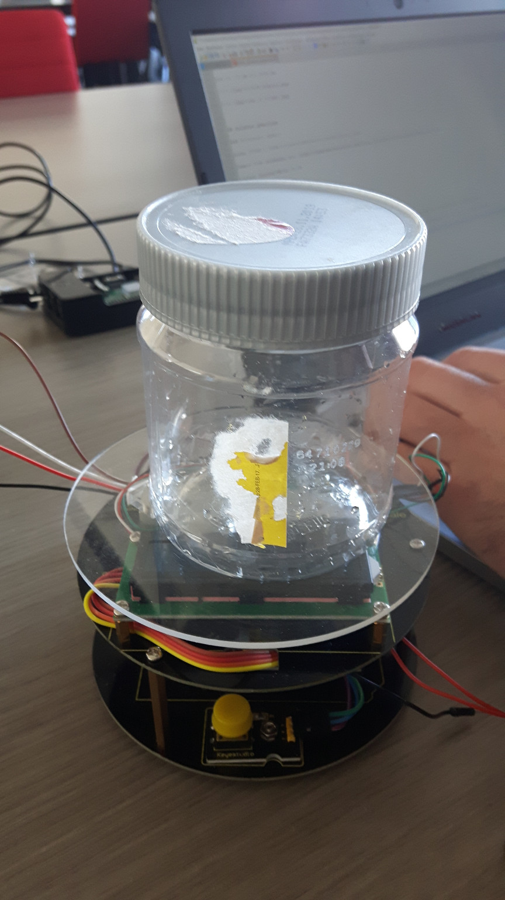
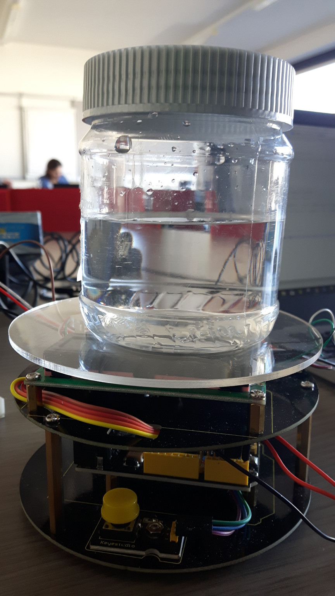
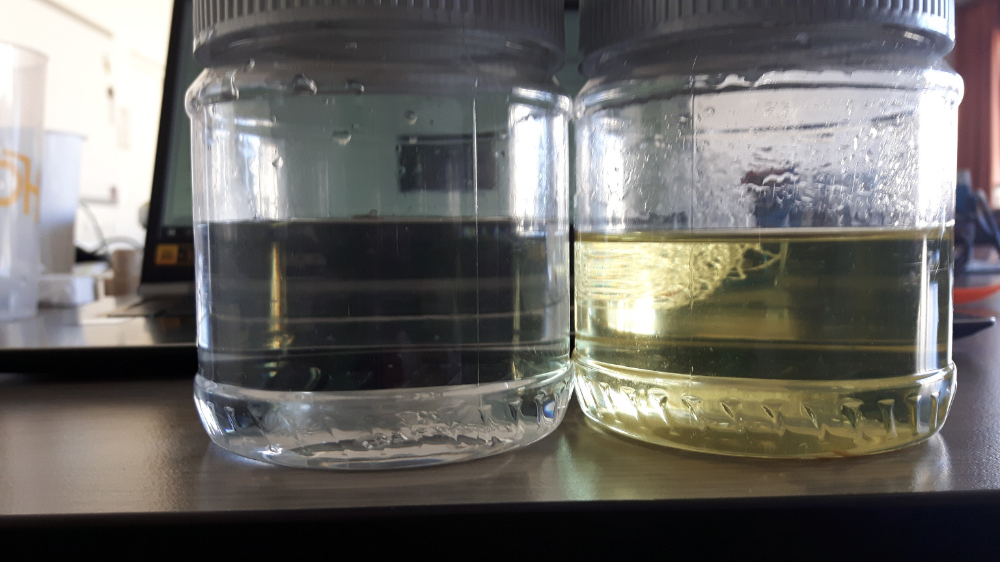
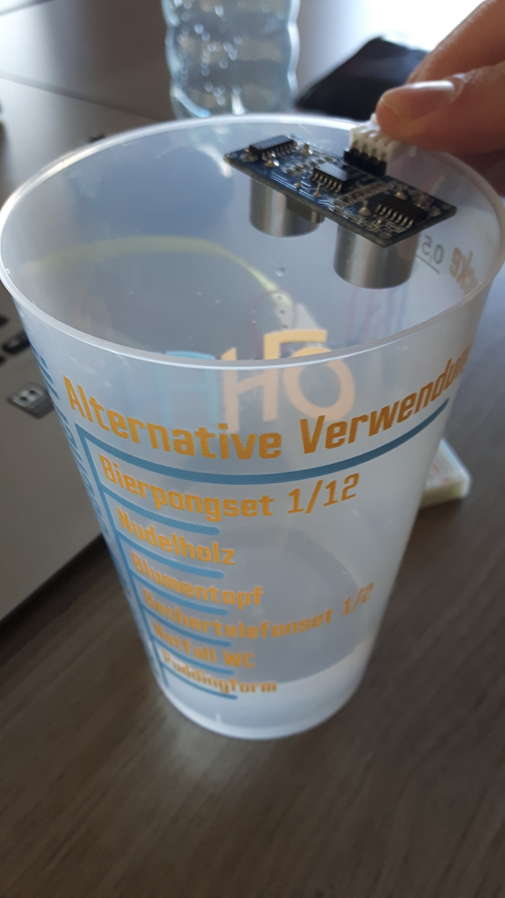
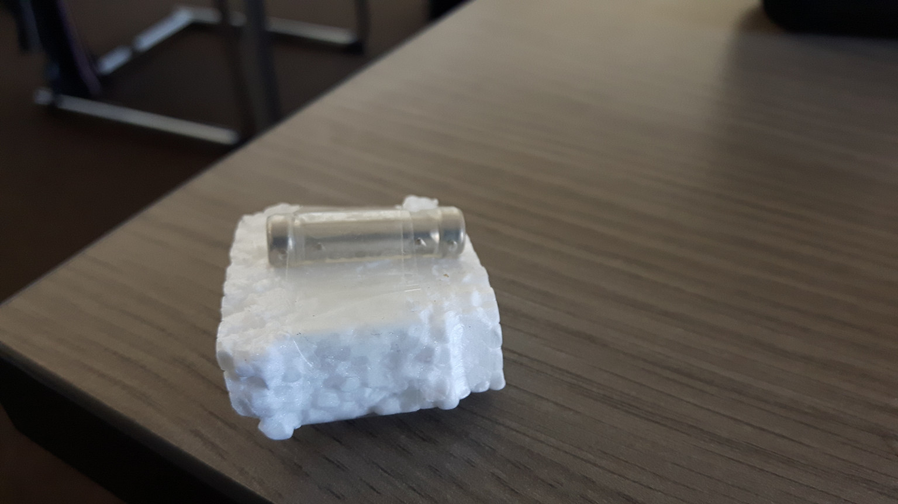
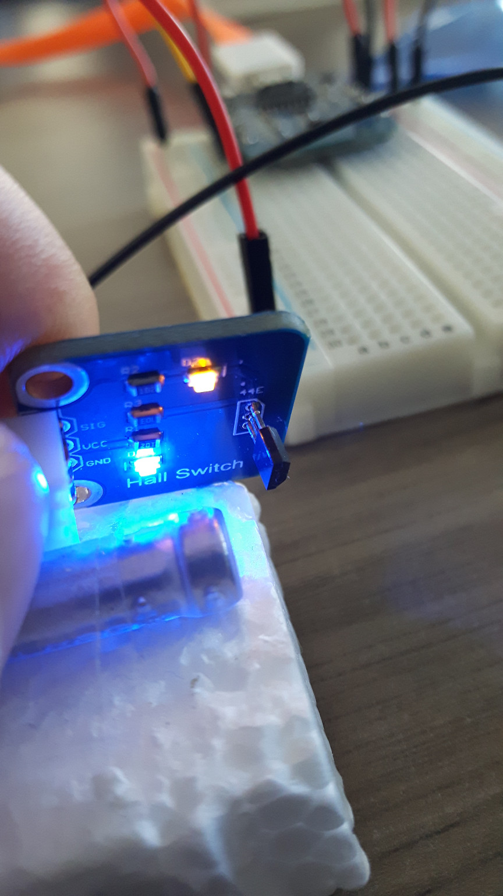
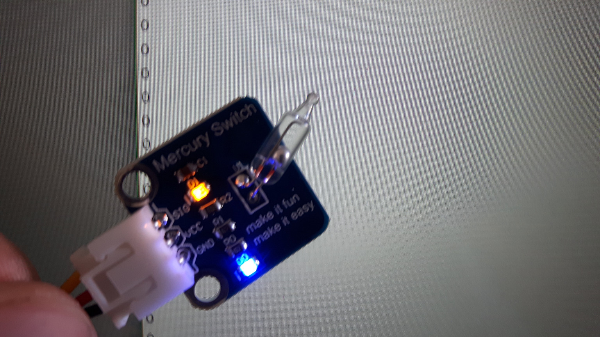
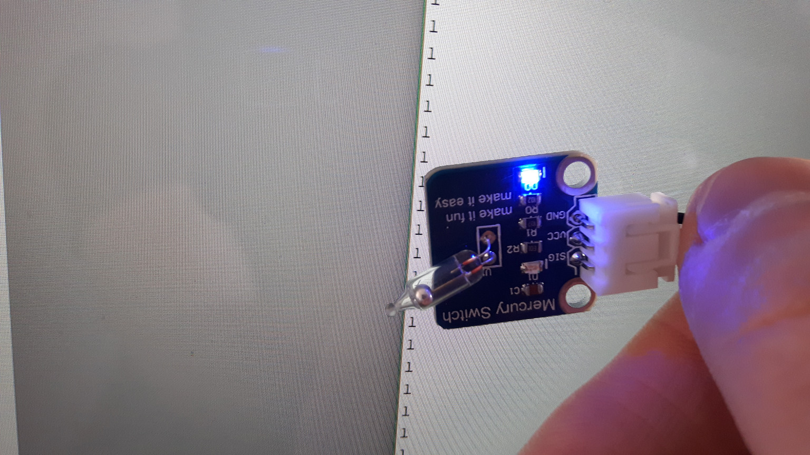

# Project #02
### 28.11.2018

##### Lab Outline

* Start project 2: measuring liquid (water and oil) challenge (acoustic distance, optical distance, weight, analog and binary conductive sensing)
* Measuring liquid (water and oil) challenge (acoustic distance, optical distance, weight, conductive sensing, physical switches)
  * Bring props: 3 bottles/containers (one for clear water, one with vegetable oil, one with dirty water), something to block lights in bottle, magnet, swimmer (cork?), scissors, glue, cardboard
* For different liquid types (clear water, dirty, oil) and each measuring challenge build systems to measure series of data over time
* Rate quality for that sensor for the specific liquid
* Produce table and recommendation for use case
* Scales stay in university

---

## Aufgaben Paul

### Raindrop Sensor

Siehe [Code](./code/raindropsensor/raindropsensor.ino).

Analoger Sensor

Bei Trockenheit liefert er Werte von 1024 (max)

Wird Wasser auf die Platte gegeben, sinkt der Wert unter 1024

## Aufgaben Boris

### Time of flight Sensor

Siehe [Code](./code/TimeOfFlight/TimeOfFlight.ino).

Library verwenden: https://learn.adafruit.com/adafruit-vl53l0x-micro-lidar-distance-sensor-breakout/arduino-code

Liefert Distanz-Werte in mm

von ca. 10 mm bis 8190 mm

## Aufgaben gemeinsam

### Ultrasonic sensor

Siehe [Code](./code/ultrasonicSensor/ultrasonicSensor.ino).

Sample Code verwenden von: https://howtomechatronics.com/tutorials/arduino/ultrasonic-sensor-hc-sr04/

Liefert Distanz-Werte in cm

Sollte nicht nass werden

### Waage

esp8266 initialisiert -> anschluss waage an esp8266 

setup.cpp -> hx711(weight, D6, D7, 419.0, true);

fehler beim anschluss -> neu verkabelt -> jetzt kommen werte im serial monitor -> 85g bei 100g gewicht -> kalibrieren

über mgtt fx -> zuerst tare -> war falsch -> calfactor +25 -> falsch -> dann -25 -> mehrmals -22 -> -2; -1 -> 100,2 gramm

messen des behälters -> 30,4g

-> tare

messung wasser -> 161,5g

(dichte von wasser 997 kg/m³) -> ausgerechnet 161,48 ml

messung öl -> 143g (dichte von rapsöl 917 kg/m³) -> ausgerechnet 155,94 ml

Ergebnis sehr genau, wie man sieht, ist etwas mehr Wasser als Rapsöl eingefüllt:

Kakao zur Simulation von Schmutzwasser
messung Schmutzwasser -> ca. 161,48 ml, 163,5g -> Dichte: 1012,5 kg/m³

### measuring liquid

versuchen den flüssigkeitsstand per ultrasonic-sensor und per magnetschalter (hall switch) zu messen

#### ultrasonic-sensor

Code [hier](./code/ultrasonicSensor/ultrasonicSensor.ino)

ultraschall sensor am oberen ende des bechers platziert:

messung mit flüssigkei: 8 cm entfernung
messung ohne flüssigkeit: 13 cm entfernung

flüssigkeitsstand = 5 cm 

problem hierbei ist das sich die flüssigkeit im tank eines schiffes sehr stark bewegt -> wert schwankt etwas, bei einem großen tank kommt man trotzdem auf einen halbwegs guten Wert (zB durch bildung des mittelwertes alle 5 sekunden).
Zusätzlich darf der Sensor nicht nass werden -> müsste an einer geeigneten Stelle platziert werden.

Option: wasserdichter ultraschall sensor -> 10 euro bei amazon

#### Hall switch

Code [hier](./code/hallSwitch/hallSwitch.ino)

Bei Magnetfeld --> 0
Normalzustand --> 1

Schwimmer in Becher gegeben mit einem Magneten bestückt:

Hat gut funktioniert -> man würde jedoch einen stärkeren Magneten brauchen -> sonst muss man sehr nahe an den Behälter

Anwendung:
Hall Switch Sensoren außerhalb am Tank befestigen.
Im Tank einen Schwimmer in einem Rohr platzieren, der einen Magneten trägt.
Flüssigkeitsstand abschätzbar dadurch, welcher Sensor das Magnetfeld des Magneten misst.

#### Mercury Switch
Liefert im "Normalzustand" bei Kontakt der Metallkugel 0
Ist die Metallkugel nach außen gekippt, ergibt das eine 1

Wiederverwendung des Arduino Codes bei Hall switch

Könnte dazu verwendet werden, um festzustellen, in welche Richtung das Boot/Schiff schwankt:

| 0 (Kugel innen)                | 1 (Kugel außen)                |
| ------------------------------ | ------------------------------ |
|  |  |

### Vergleich und Rating

Rating: \* bis \*\*\*\*\*, wobei mehr Sterne eine bessere Bewertung bedeuten
|      |  Wasser    |  Abwasser    |  Treibstoff   |
| ---- | ---- | ---- | ---- |
|   Raindrop Sensor   |  möglich, jedoch durch Schwanken des Boots Sensor schlägt aus und braucht Zeit damit Werte sich "erholen"  \*\*  | möglich, jedoch durch Schwanken des Boots Sensor schlägt aus und braucht Zeit damit Werte sich "erholen"\*\*      | nicht geeignet, kein Wasser     |
| Time of flight sensor (optisch) | geeignet, mit Schwimmer (Ziel) und transparenter Schutzabdeckung \*\*\*\* | eher ungeeignet wegen Schmutzpartikel (könnte Sensor abdecken) \*  | geeignet, mit Schwimmer (Ziel) und transparenter Schutzabdeckung \*\*\*\* |
|Ultrasonic sensor (akustisch) |geeignet, wenn wasserdicht/Schutz \*\*\*\*\* | eher ungeeignet wegen Schmutzpartikel (könnte Sensor abdecken) \* | geeignet, wenn Schutz vorhanden \*\*\*\*\* |
| Scale | geeignet (Dichte bekannt) \*\*\* | eingeschränkt geeignet (Dichte kann variieren) \*\* | geeignet (Dichte bekannt) \*\*\* |
| Hall switch (Magnetfeld) | geeignet, jedoch mehrere Sensoren notwendig \*\*\*\* | geeignet, jedoch mehrere Sensoren notwendig \*\*\*\* | geeignet, jedoch mehrere Sensoren notwendig \*\*\*\* |
| Mercury Switch | geeignet um | Neigung des Boots | festzustellen |

### Empfehlung

##### Wasser

Am einfachsten ist die Verwendung eines Ultraschallsensors. Davon wird ein wasserdichtes Modell gewählt. Der Sensor wird oben am Tank platziert und nach unten ausgerichtet. Optional kann eine Waage unter dem Tank installiert werden.

##### Abwasser

Für Abfallwasser können außen am Tank mehrere Hall switch Sensoren in verschiedenen Höhen angebracht werden. Im Inneren des Tanks wird an der Seite der Sensoren ein Rohr angebracht. In diesem Rohr befindet sich ein Schwimmer mit einem Magneten, der dem Flüssigkeitsstand des Tanks entsprechend folgt. Das Rohr und der Tank sollten nicht aus magnetischen Materialen bestehen, damit eine Messung möglich ist. Überschreitet der Schwimmer einen bestimmten Sensor, so weiß man den geschätzen Flüssigkeitsstand.

##### Treibstoff

Am einfachsten ist hier ebenso die Verwendung eines Ultraschallsensors. Dieser braucht ebenfalls eine Schutzabdeckung, um vor Schäden vom Treibstoff geschützt zu sein. Der Sensor wird oben am Tank platziert und nach unten ausgerichtet. Optional kann eine Waage unter demTank installiert werden.

