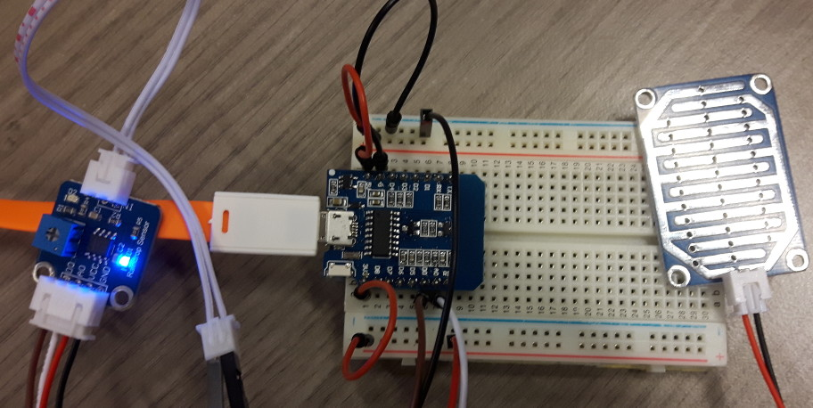
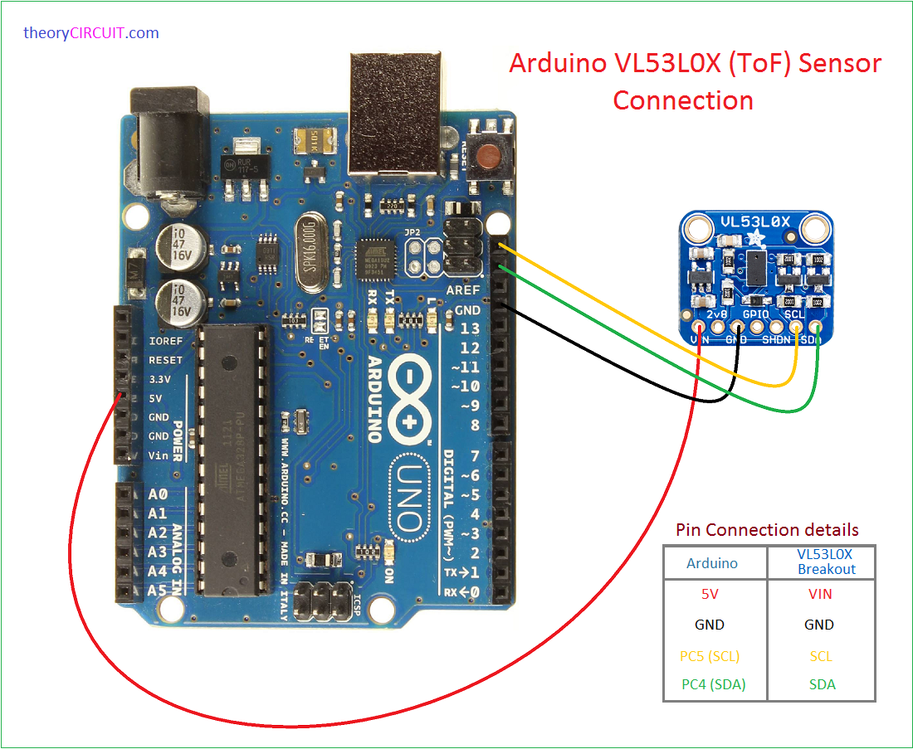
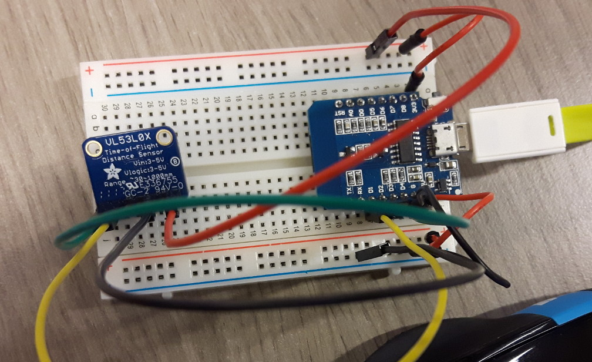
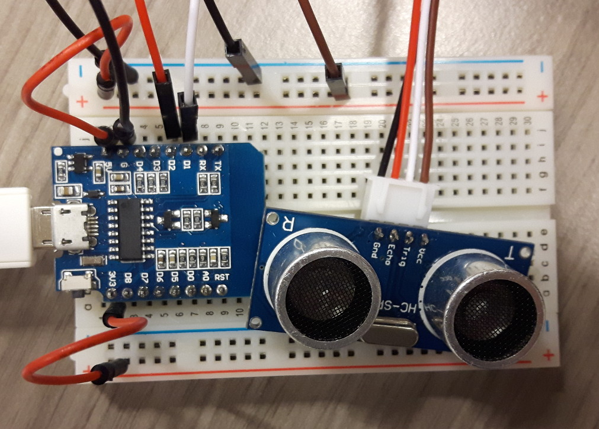
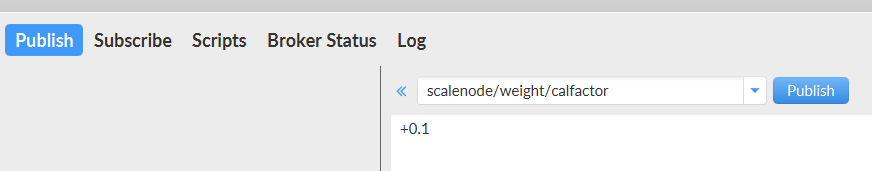
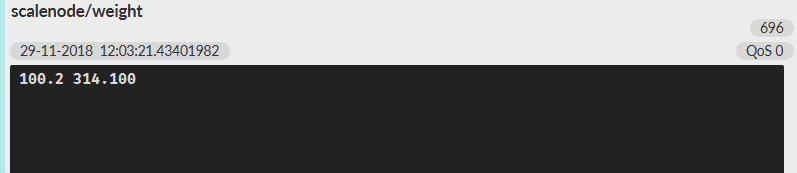

# Project #02
### 28.11.2018

##### Lab Outline

* Start project 2: measuring liquid (water and oil) challenge (acoustic distance, optical distance, weight, analog and binary conductive sensing)
* Measuring liquid (water and oil) challenge (acoustic distance, optical distance, weight, conductive sensing, physical switches)
  * Bring props: 3 bottles/containers (one for clear water, one with vegetable oil, one with dirty water), something to block lights in bottle, magnet, swimmer (cork?), scissors, glue, cardboard
* For different liquid types (clear water, dirty, oil) and each measuring challenge build systems to measure series of data over time
* Rate quality for that sensor for the specific liquid
* Produce table and recommendation for use case
* Scales stay in university

---

## Aufgaben Paul

### Raindrop Sensor

Siehe [Code](./code/raindropsensor/raindropsensor.ino).

Analoger Sensor

Bei Trockenheit liefert er Werte von 1024 (max)

Wird Wasser auf die Platte gegeben, sinkt der Wert unter 1024

## Aufgaben Boris

### Time of flight Sensor

Siehe [Code](./code/TimeOfFlight/TimeOfFlight.ino).

Library verwenden: https://learn.adafruit.com/adafruit-vl53l0x-micro-lidar-distance-sensor-breakout/arduino-code

Liefert Distanz-Werte in mm

von ca. 10 mm bis 8190 mm

## Aufgaben gemeinsam

### Ultrasonic sensor

Siehe [Code](./code/ultrasonicSensor/ultrasonicSensor.ino).

Sample Code verwenden von: https://howtomechatronics.com/tutorials/arduino/ultrasonic-sensor-hc-sr04/

Liefert Distanz-Werte in cm

Sollte nicht nass werden

### Waage

esp8266 initialisiert -> anschluss waage an esp8266 

setup.cpp -> hx711(weight, D6, D7, 419.0, true);

fehler beim anschluss -> neu verkabelt -> jetzt kommen werte im serial monitor -> 85g bei 100g gewicht -> kalibrieren 

über mgtt fx -> zuerst tare -> war falsch -> calfactor +25 -> falsch -> dann -25 -> mehrmals -22 -> -2; -1 -> 100,2 gramm

messen des behälters -> 30,4g -> tare

messung wasser -> 161,5g (dichte von wasser 997 kg/m³) -> ausgerechnet 161,48 ml

messung öl -> 143g (dichte von rapsöl 917 kg/m³) -> ausgerechnet 155,94 ml

Kakao zur Simulation von Schmutzwasser
messung Schmutzwasser -> 161,48 ml, 163,5g -> Dichte: 1012,5 kg/m³

### measuring liquid

versuchen den flüssigkeitsstand per ultrasonic-sensor und per magnetschalter (hall switch) zu messen

#### ultrasonic-sensor

Code: https://github.com/paulisch/iot_fuchs_schmutz/blob/master/exercises/proj02/code/ultrasonicSensor/ultrasonicSensor.ino

ultraschall sensor am oberen ende des bechers platziert (siehe foto)

messung mit flüssigkei: 8 cm entfernung
messung ohne flüssigkeit: 13 cm entfernung

flüssigkeitsstand = 5 cm 

problem hierbei ist das sich die flüssigkeit im tank eines schiffes sehr stark bewegt -> wert schwankt etwas, bei einem großen tank kommt man trotzdem auf einen halbwegs guten wert (zB durch bildung des mittelwertes alle 5 sekunden)
zusätzlich darf der sensor nicht nass werden -> müsste an einer geeignete stelle platziert werden

option: wasserdichter ultraschall sensor -> 10 euro bei amazon

#### Hall switch

Code: ./code/hallSwitch/hallSwitch.ino

Bei Magnetfeld --> 0
Normalzustand --> 1

hat gut funktioniert -> man würde einen starken magneten brauchen -> sonst muss man sehr nahe an den behälter

Anwendung:
Hall Switch Sensoren außerhalb am Tank befestigen.
Im Tank einen Schwimmer in einem Rohr platzieren, der einen Magneten trägt.
Flüssigkeitsstand abschätzbar dadurch, welcher Sensor das Magnetfeld des Magneten misst.

Mercury Switch:
Liefert im "Normalzustand" bei Kontakt der Metallkugel 0
Ist die Metallkugel nach außen gekippt, ergibt das eine 1

