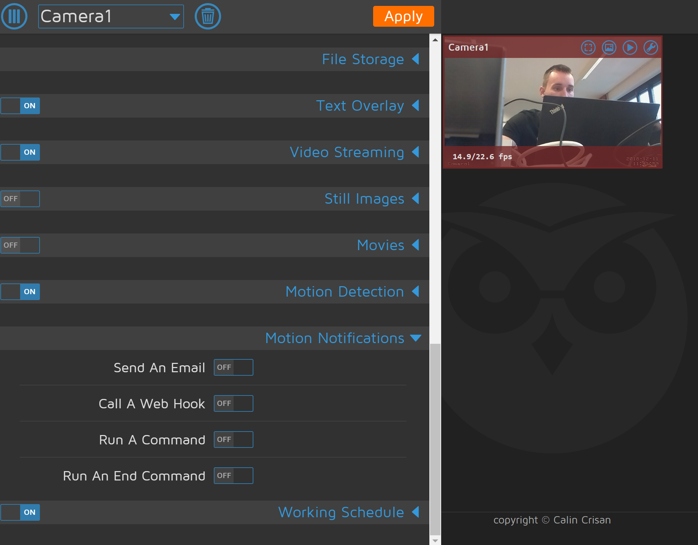

# Raspberry PI Kamera mit MotionEyeOS

### laden und einrichten von MotionEyeOS
 * Download Image -> https://github.com/ccrisan/motioneyeos/releases
 * image auf sd karte -> mit etcher
### WLAN verbindung vorbereiten -> https://github.com/ccrisan/motioneyeos/wiki/Wifi-Preconfiguration
 * erstellen von wpa_supplicant.conf
 * einfügen des code:
   
		country=AT
    ​    update_config=1
    ​    ctrl_interface=/var/run/wpa_supplicant    
    ​    network={
    ​        scan_ssid=1
    ​        ssid="MyWiFiSSID"
    ​        psk="S3cr3tp@$$w0rc|"
    ​    }
### MotionEyeOS starten
 * sd karte in raspberry -> starten des Raspberry
 * finde raspbery nicht -> ändern der network einstellungen auf: network: scan_ssid=1; ssid="dirtyfox"; psk="fuchsschmutz"
 * finde IP nicht (git bash) -> versuche jetzt über externen bildschirm einzusteiigen
 * geht noch immer nicht, bildschirm bleibt schwarz
 * image wird neu aufgespeilt auf sd karte
 * jetzt zeigt der raspberry etwas auf dem bildschirm an, er kann sich nicht mit dem WLAN verbinden (no Linkt)
 * versuche nochmal wpa_supplicant.conf zu bearbeiten -> geht nicht, er verbindet sich nicht mit unserem netzwerk (dirtyfox)
 * tausch des raspberry pi 1 auf einen raspberry pi 3 -> da dieser ein wlan modul integriert hat
 * hat jetzt funktioniert -> motionOS läuft unter 192.168.12.20

### verknüpfung mit node red oder mqtt
* versuche mit node red zu verbinden -> laut den entwicklern von MotionEyeOS ist dies nicht unterstützt, man musste dies selber im sourcecode implementieren

* motion notification über 192.168.12.20 -> erster versuch ist über Call A Web Hook -> Web Hook URL (https://192.168.12.1/nodered/testcam) -> HTTP Method (GET)

* in node red einen "http in" node angelegt

* dann bei motioneyeos https://192.168.12.1/nodered/testcam -> geht nicht -> wahrscheinlich wegen https und passwort -> prof. fragen -> wir gehn über git bash in den pi
* login bei dem motionOS pi -> git bash ->  ssh pi@192.168.12.20 -> geht nicht, das passwort ist nicht bekannt, kein login möglich

* googlen nach lösung -> lösung ist ssh admin@192.168.12.20 -> dann ist man eingeloggt -> suche nach apt, pacman, dpkg -> erfolglos

* dann suche nach ssh -> geht -> versuch über den motionOS pi auf den ulnoIoT pi einzuloggen -> ssh ulnoiot@192.168.12.1 -> hat funktioniert

* neuen user anlegen auf ulnoIoT pi -> adduser: report -> password: iotempire -> full name: mqttreporter -> hat funktioniert -> logout

* login bei motionOS pi -> versuchen einen Key zu generierenn (ssh-keygen -> Generating public/private rsa key pair.) und zu speichern -> hat nach umwegen funktioniert -> dann schlüssel anzeigen lassen und kopieren
* dann wieder bei ulnoIoT pi einloggen -> diesmal mit dem user "report" (ssh report@192.168.12.1) ->  dann ssh key bearbeiten und unseren key einfügen (siehe bild )
  * report@ulnoiotgw:~ $ mkdir .ssh
  * report@ulnoiotgw:~ $ chmod 700 .ssh
  * report@ulnoiotgw:~ $ cd .ssh
  * report@ulnoiotgw:~/.ssh $ tilde authorized_keys

  * report@ulnoiotgw:~/.ssh $ chmod 600 authorized_keys
  * report@ulnoiotgw:~/.ssh $ logout

##### History:

[root@meye-811b25c4 ~]# history
​    1  apt
​    2  pacman
​    3  dpkg
​    4  echo $PATH
​    5  ssh
​    6  ssh ulnoiot@192.168.12.1
​    7  ssh-keygen
​    8  mount
​    9  mount -o remount,rw /
   10  ssh-keygen
   11  cat .ssh/id_rsa.pub
   12  ssh ulnoiot@192.168.12.1
   13  ssh report@192.168.12.1
   14  ssh report@192.168.12.1
   15  ssh report@192.168.12.1 mqtt_send /cam motion
   16  ssh report@192.168.12.1 mosquitto_pub -h localhost -t /cam -m motion
   17  ssh report@192.168.12.1 mosquitto_pub -h localhost -t cam -m motion
   18  history

### Abschlussarbeiten:
  * ssh report@192.168.12.1 mosquitto_pub -h localhost -t cam -m motion  -> wird bei motioneyeos in der webUI unter "motion notification -> Run A Command" eingefügt 
  * jetzt im node red einen mqtt node angelelegt -> mit topic "cam" und einem debug node 
  
  * dann noch eine motion detection in der motioneyeos webUI eingefügt (damit die kamera auf bewegung reagiert) -> apply
  * versuch die hand vor die kamera zu halten -> funktioniert
   
  * jz noch versucht über die punkte "file storage" und "still images" ein foto auzunehmen und zu speichern -> funktioniert -> habe noch zusätzlich WinSCP heruntergeladen um manuel auf das filesyste zuzugreifen
   
   
  * die URL zu den fotos oder videos suchen (auch für livestream) -> Bild im Browser aufmachen: http://192.168.12.20/picture/1/preview/2018-12-11/15-04-39.jpg -> finden des livestreams

  

 