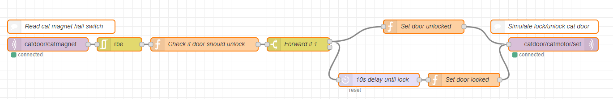

# Project #03

Projekt: **Smart Home**

#### Team

- Boris Fuchs & Paul Schmutz
- Anika Seibezeder & Simon Angerbauer
- Roman Socovka & David Mitterlehner

Leitfaden: https://docs.google.com/document/d/1clOaLvnObF7xb4quhJDqLjVOhUlx8wYoteGtU5CIqnE

Thema dieses Protokolls: **Katzenklappe, Wecker-Lampe**

Benötigte Sensoren/Aktoren:

Für die Katzenklappe:

* Hall Switch
* Magnet
* Servo-Motor (Tower Pro SG90)

Für die Wecker-Lampe:

* RGB LED
* Android App mit für den Wecker (Roman)

Person(en): Paul Schmutz

#### Vorgehensweise Catdoor

1. Upgrade für UlnoIoT durchführen

~~~
ulnoiot upgrade
~~~

Befehl 2x ausführen.

2. Ordnerstruktur vorbereiten für Proj03 anhand lib/system_template.
   Anlegen eines Ordners für den Knoten "**catdoor**"

2. Wemos initialisieren (an Pi per angeschlossen)

~~~
catdoor$ initialize serial
~~~

Fehler bei Kompilieren aufgetreten. Auf Wemos wurde ein Reset durchgeführt. Fehler noch immer vorhanden. Austauschen durch einen anderen Wemos. Fehler nach wie vor. Da vorhin ein Upgrade von UlnoIoT durchgeführt wurde, wurde der Raspberry sicherheitshalber neu gestartet. Nach probieren von initialize serial, erneut der folgende Fehler:

Anschließend wurde 

~~~
platformio lib search "header:lux-tsl2561.h"
~~~

durchgeführt. Daraus entsteht folgender Fehler: Nothing has been found by your request

Jedoch wurde ein Hinweis auf ein Upgrade von platformio ausgegeben.

~~~
platformio upgrade
...
PlatformIO has been successfully upgraded to 3.6.2
~~~

Nach erneutem Versuch von "initialize serial" bleibt obiger Fehler nach wie vor bestehen.

Der Raspberry wurde nochmal neu gestartet.

Nach erneutem Versuch ist "initialize serial" wiederum fehlgeschlagen.

Nach ca. 60min versuchen habe ich den Fehler auf https://riot.im/app/#/room/#ulnoiot:matrix.org gepostet. Es stellte sich heraus, dass ein PUSH fehlte. Nachdem Sie das behoben haben, versuchte ich es erneut. Ein "ulnoiot upgrade" wurde nun noch 2x durchgeführt.

Nun ist der Fehler behoben.

3. Aufbau und Programmierung des Servo-Motors

setup.cpp

~~~c++
servo(catmotor, D0);
~~~

Aufbau:

Aufbau anhand: http://www.ee.ic.ac.uk/pcheung/teaching/DE1_EE/stores/sg90_datasheet.pdf

Mit MQTT.fx werden nun Testnachrichten gesendet. Bei Aufruf vom Topic "catdoor/catmotor/set" wird der Motor gedreht. Das simuliert das Öffnen/Schließen des Schlosses der Katzenklappe (zB ein Riegel).

Der Motor wurde in der Übung am 11.12.2018 noch ausgetauscht durch einen "normalen" Motor. Der ursprünglich verwendete Motor war "gehackt" und 360° drehfähig. Dies wird nun durch den regulären Motor ersetzt durch eine Drehung um -90° bzw. +90°, um das Ver- und Entriegeln der Katzenklappe zu simulieren.

4. Hall Switch einbinden zur Erkennung der Magnetfeldänderung

setup.cpp

~~~c++
input(catmagnet, D1, "0", "1");
~~~

Wird ein Magnet zum Hall Switch bewegt, wird "1" gesendet, ansonsten stets "0".

Die Katze trägt ein Halsband mit einem Magneten. Der Hall Switch Hall Switch ist an der Katzenklappe angebracht. Somit soll durch den Hall Switch das Ent- und Verriegeln der Katzenklappe geschehen.

5. Implementierung in Node RED

Der Sensor ist an der Katzenklappe angebracht. Berührt der Magnet der Katze den Hall Switch, soll nun der Riegel der Katzenklappe für ca. 10 Sekunden geöffnet werden, damit die Katze raus oder rein kann. Danach sperrt die Katzenklappe wieder, indem der Motor erneut gedreht wird. Diese Logik muss nun in Node RED implementiert werden.

Der Gesamtaufbau in Hardware sieht nun so aus:

##### Use Case

Wie in der obigen Abbildung zu sehen ist, soll das System einen Anwendungsfall für die Katzenklappe realiseren. Die Katzenklappe ist von innen nach außen immer offen, d. h. Katzen können immer durch die Katzenklappe aus dem Haus gelangen. Von außen nach innen ist die Katzenklappe zugesperrt mithilfe eines Riegels, der durch den Motor gesteuert werden kann. Die Katzen sind mit einem Magnet am Halsband ausgestattet. Nähert die Katze sich der Katzenklappe, so wird der Magnet vom Hall Switch (dieser ist an der Katzenklappe angebracht) detektiert. Daraufhin wird über MQTT der Motor angesteuert und die Klappe entriegelt. Die Klappe ist nun für 10 Sekunden geöffnet. Die Katze kann somit ins Haus gelangen und nach 10 Sekunden wird die Klappe wieder verriegelt.

In echter Umgebung sieht das folgendermaßen aus:

#### Vorgehensweise Wecker-Lampe

1. Wemos initialisieren

~~~
clockled$ initialize serial
~~~

2. setup.cpp bearbeiten und LED einrichten

~~~C++
rgb_single(rgb, D0, D1, D2, true);
~~~

true...invertieren, da die LED invertiert ist

3. Deploy

~~~
deploy
~~~

Mit den MQTT Topics clockled/rgb/rgb/set und Payload "r,g,b" [0-255] kann die Farbe gesetzt werden. Mit clockled/rgb/brightness/set und Payload "[0-255]" die Helligkeit.

#### Source code

Siehe Source [Code Verzeichnis](./code/proj03_smart_home).

#### NodeRED

Siehe [Node RED Exports](./code/node_red)

#### Media

Nach der Implementierung meiner zugewiesenen Tasks, stellte ich das Videomaterial für die Szene mit der **Katzenklappe** bereit.

Weiters habe ich die Übersetzung für den **Erzähler-Text** sowie das Sprechen und Aufnehmen des Texts übernommen. Text siehe [hier](./media/audio/Sprecher_Text.odt).

Rohmaterial von Video und Audio unter: https://drive.google.com/open?id=10DHWuZlNED0WJXQR2nqwjLXLMhILBoDt

Folien für die Präsentation: https://docs.google.com/presentation/d/1v0V9SePKOd0H1CGaCHZMs_VDuehRpZWENDShHaICCyI/edit

#### Globale Dokumentation

Ein Leitfaden durchs gesamte Projekt befindet sich in [folgender Datei](./project_notes.md).