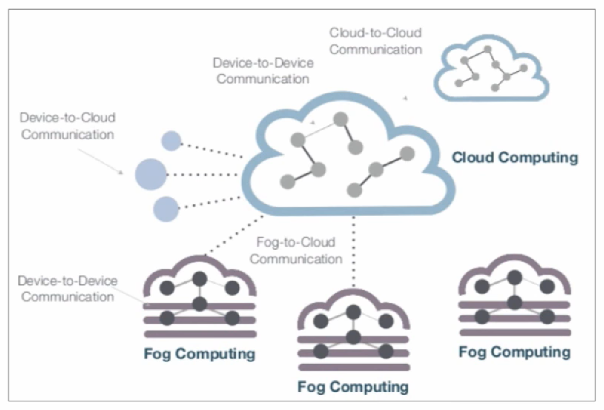
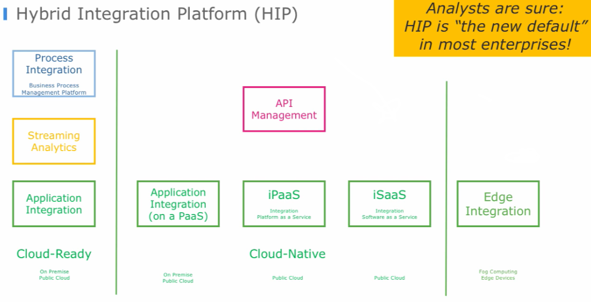

# Session #01
### 15.11.2018

#### Introduction
Today was the first day of the new course Internet Of Things (IOT). I was already looking forward to a new subject after weeks of Secure Mobile Systems (SMS). Also, I was curious about what the contents of IOT will be.

#### Lecture #01
At first, I was very confused about the structure of the lecture. Different from the rest of our courses all resources were located in places other than moodle. Secondly, the syllabus was quite unusual - especially some grading factors:
* lecture records
* portfolio

I have to admit, I was very unhappy in the first lecture, confused and I didn't know what creating a portfolio means. In my opinion, one could structure the explanation of what the exact tasks for us students consists of more clearer.
An exhilarating fact however was, that there is no exam. So after some minutes of thinking (and asking questions to you) I realized that the system is actually pretty good, but just a bit new to me.
I myself am not a designer, however I think slides could need some fancy improvements overall, but I am good with simple structured and non-overly-colorful resources.
Also, I have to mention, that (altough it was confusing and hard to understand at first) you are friendly, speak clearly and are ready to help anytime, which is important for me.
Furthermore, it is a good idea to keep the students awake during lecture with some questions to work on. I found the first lecture's content about IOT interesting. Besides the questions, I found it especially interesting, what the video showed about IOT and what dimension to expect from IOT.
To sum it up, I was quite overwhelmed in the first place, however as things got clearer to me, I now like the concept of the course.

PS: You can find the lecture notes [here](../lecturenotes/lecture01.md).

#### Exercise #01
##### Lab Outline
* Setup raspberry pi iot gateway based on ulnoiot image
* [Setup key and ssh into it]
* Learn to blink on ESP8266 with Arduino IDE
* Login to wifi of pi from ESP8266
* Trigger blink remotely.
* Work in pairs.
* Document everything also (especially) failures → in portfolio git folder
* Optional: make button work remotely (on second ESP8266), explore platformio
---
I work together with Boris Fuchs. As he already has experience with Raspberry Pi, he worked on setting up the Raspberry with the provided image.
While Boris was working on the Raspberry my task was to deal with the ESP8266. Quickly Boris and me found all necessary components to program and connect.
Setting up the Arduino IDE was quite easy. I 've never worked with it before. To work with the ESP8266 you have to do some extra steps to get the program to the ESP - downloading the right configuration (see exercise notes). It took me a while to select the right board (which was LOLIN(WEMOS) D1 R2 & mini). As there are example programs (and google/stackoverflow) after the I quickly found out how to write a LED blinking program (see [here](https://github.com/paulisch/iot_fuchs_schmutz/blob/master/exercises/ex01/esp8266_blink_led/esp8266_blink_led.ino)).
Also, by combining an internet source with a WiFi example in Arduino IDE I completed setting up a web page with buttons to turn on/off the LED in a few minutes. A tricky part was to find out the IP address of the ESP. That was in fact clear afterwards, as it was included in the example - to print it out to the Serial printer and show it with the Arduino Serial monitor. You can find the LED webserver program [here](../../exercises/ex01/esp8266_wifi_led/esp8266_wifi_led.ino).

PS: You can find the exercise notes [here](../../exercises/ex01/fuchs_schmutz_ex01.md).
* * *

# Session #02
### 16.11.2018

#### Lecture #02
Today I was more comfortable from the beginning. As expected we had to do some more team work. Somehow I am not too excited about group work in the lecture. However, as soon as things get going, I feel better and follow the "flow" of the class.
Today's first exercise was finding out about RS232 (1), I2C (2), SPI (3), Onewire(4). I had the topic "Onewire" together with Markus Seiberl, Valentin and Stefan. After that we compared results with the other groups, which I spoke about with Boris, Anika and Simon. At first I thought it is not efficient to split in groups but afterwards I thought we found quite much information.
Furthermore, we learned about "(user) stories" describing business ideas relying on IOT. It is actually quite hard to find such stories. However, I think it is very useful to form stories as you can derive class models for the later software model.
Part of our tasks was to create a story which you can find in the lecture notes. It was really interesting discussing and finding ideas!

PS: You can find the lecture notes [here](../lecturenotes/lecture02.md).

#### Exercise #02
##### Lab Outline
* Finish tasks from Lab 1 (especially remote trigger)
* Create Button Device, which triggers via HTTP Post to IFTTT WebHook → then triggers (a) report to phone or (b) tweet (emergency remote, tweet button, shopping button)
* Figure out how to use I2C 2 lines display
  * optional: use I2C display to show message when ifttt event triggered
* Get remote data from DS11 onewire temperature device
* HW:
  * Finish Lab work
  * In team: come up/research 2 potentially useful IoT scenarios where parts could be commercialized → tell a story where this is used successfully → needs to show up in portfolio (which I will review first time next week)
---

Regarding **homework**: You can find the 2 ideas in my lecture notes. The first one of them was done in a group in the lecture. The second one counts as idea 1 of the 2 ideas (which was made by me) I do with Boris. So check Boris' notes for the 2. idea.

Today's exercise was a bit more advanced than yesterday and it sets up on the findings of the last exercise. As I am more the software type of person, I mostly dealt with writing software in the Arduino IDE making the buttons, WiFi etc. work. As Boris is good at dealing with the hardware stuff we made a good team today. He managed to put the components and cables into the right place and communicated the relevant ports for me. I then used the ports in the software to run the system as a whole. Sometimes it was a bit tricky to find the right library and manage to finally get the code to work but after some trying and cooperating with Boris everything was up and running smoothly.
I liked today's exercise, although I was really kind of stressed as my head was full from concentrating the whole time.

PS: You can find the exercise notes [here](../../exercises/ex02/fuchs_schmutz_ex02.md).
* * *

# Session #03
### 20.11.2018

#### Lecture #03
Lecture today was mainly doing research in teams. I adapted to the different (compared to ordinary teacher-centred teaching), however it is still something new to me. Today's lecture still didn't quit blow my mind, as IoT (by now) is still very theoretical for me.
The lecture's topic was protocols for IoT. I don't disagree with the idea of the students researching certain topics, although I would like a bit more crucial facts covered in the slides. The reason is that many students may find different sources which could possibly be unreliable and also sharing the research with others by speaking and listening can be error-prone as well. Therefore, I would appreciate "one true source" of the professor including essential facts and practical examples to use for the exercise. As it is now, I find myself always researching again and again in the exercise because I still don't know what certain tools are or how to use them which could be covered in the slides.
Nevertheless, I found the topic of protocols quite interesting and useful. I already knew some of them, like JSON and XML. However, CBOR was highly interesting to me as it is a binary format based on JSON which can be of interest for me in future projects.

PS: You can find the lecture notes [here](../lecturenotes/lecture03.md).

#### Exercise #03
##### Lab Outline
* COAP
   * Install simple COAP Arduino library example (use esp32 example, adjust led, and use ESP8266Wifi.h)
   * Explore and switch with Copper4Cr (Chrome developer extension – or old firefox <= 55 with copper extension)
   * Optional: use libcoap binary tools
* MQTT
   * Install mqtt.fx on your laptop
   * Send and receive with mqtt.fx messages to mosquitto (mqtt server) running on pi
   * Build simulators (use your peferred language and mqtt library or consider ulnoiot's integriot in python)
    * Temperature sensor simulator
         * Start temp, end temp, time to linearly rise
    * Relay switch (like AC) simulator
         * Showing on and off
    * Integrator: switch at specific temperature (can be hardcoded)
---
First of all, COAP and MQTT are entirely new to me. Today we were a bit slow at doing the exercise. We just managed to do the first part "COAP". The Arduino code was easy to set up. The way "talking" to the ESP8266 was a bit buggy. Boris tried different browsers and finally Chrome worked after several (same) tries. In the end, it was not difficult at all but somehow always when doing things for the first time it requires some effort.
Also, we started the secon part which is trying MQTT with the raspberry pi. The simulator is not yet implemented. As things work so far I think we will make good progress next time.
I liked the first insight into IoT protocols. It feels more like doing business-related standardized tasks which are of more practical use than exercises before and also allow greater opportunities in shorter programs. In my opinion that is the goal of the course anyway - to start from zero and slowly develop to finally be able to do more complex projects while understanding everything from the ground up.

PS: You can find the exercise notes [here](../../exercises/ex03/fuchs_schmutz_ex03.md).
PPS: I am definitely sure, that the simulation task of MQTT will be great for me as I see myself as the software developing type.

# Session #04
### 21.11.2018

#### Lecture #04
The lecture today was (by now) my favorite lecture regarding IoT. At the beginning we did a small retrospect which made me realize that we already know useful things. Furthermore, the style of lecturing - as I mentioned in my last report in Session #03 - is now somehow ordinary. I also believe, that it's more effective than traditional lecturing. Anyway, today was more exciting as we didn't cover that many things (in my opinion) which was less stressful and made things more memorable. It was nice, to not google things from the beginning on, when we did the questions about "Scaling and Testing". What I liked most about that topic, was open discussion as you wrote down notes about it live on the screen. It remembered me a bit of school back then, when the teacher was writing notes on the board. Which is a good thing. I liked following your speech/question answering/discussion with us and the notes being written down.

To sum it up, I enjoyed todays lecture and the way we progress and build things on top of other related knowledge we already discovered.

PS: You can find the lecture notes [here](../lecturenotes/lecture04.md).

#### Exercise #04
##### Lab Outline

- MongooseOS
  - Build system: Read and write GPIO (implement in hardware)
  - Advanced tutorial: temperature sensor
  - Optional: Connect to local MQTT server
- **HW**, watch: https://www.youtube.com/watch?v=uOrLOgsCpNE and add to portfolio answers to:
  - What is fog computing?
  - What is the edge (regarding IoT)?
  - What are the different categories of the presented open source frameworks?
  - Which framework did you like best and why?

---

In the lab Boris and I focused more on exercise #03 as we didn't manage to finish that last time. We started with the MQTT task. I did the part having to do with [temperature simulation](../../exercises/ex03/java/TemperatureSim/src/at/fhhgb/mc/iot/ex03/Main.java) and Boris the  [integrator part](../../exercises/ex03/java/on_off_simulator/src/on_off_simulator/main.java) while also worked together on both projects at the same time.

Also, we started to work on MongooseOS. We will continue that in the next session. My first impression was very good as the tool looks very promising. The tutorial on https://mongoose-os.com/docs/quickstart/setup.md is very useful and we stopped at "8. Add device to the mDash management dashboard". So far I am confident that next time we will quickly be able to build a nice (hardware-)related solution.

The MQTT tasks today showed me (in spite of the fact, that it was just simulators), that MQTT is a really useful protocol/tool to exchange data and trigger events in a complex systems because many low-level/-energy devices can "speak" MQTT and react on certain messages. Also, MQTT is obviously often used in the world of IoT (for example Node RED). Therefore, I really focused on MQTT as it will probably be an important part in the future of this course and for personal projects.

##### Homework (watch [IoT Open Source Integration Comparison](https://www.youtube.com/watch?v=uOrLOgsCpNE))

###### What is fog computing?

=Edge computing

Part of Hybrid Integration Platfrom (HIP)

Means device-to-device communication, not only communication with the cloud

The cloud is not always the central logic

Reason: keep the data closer "to the edge"

Add logic to the local gateway or devices

* local control
* more reliable
* less traffic to the cloud

###### What is the edge (regarding IoT)?

Integrating edge devices, important for IoT, part of Hybrid Integration Platfrom (HIP)

The edge is the local part of IoT, which is not the cloud but local integration regarding gateway and devices. That means communication between the devices and a gateway independent from the cloud.

###### What are the different categories of the presented open source frameworks?

Eclipse Kura + Apache Camel: for developers (writing code); Focus: IoT Gateway

Node-RED: for developers / integration specialists; Focus: Integration on IoT Gateway

Flogo: for developers / integration specialists; Focus: Integration on IoT Gateway and very lightweight edge applications

###### Which framework did you like best and why?

--> Flogo

* It is lightweight and compared to Node-RED it is suitable for really basic hardware
* Less dependencies compared to Eclipse Kura and Node-RED
* Even if you are more flexible with Eclipse Kura (full code control) you can still do a lot of things with Flogo
* Quick build process and small output sizes

PS: You can find the exercise notes [here ex03](../../exercises/ex03/fuchs_schmutz_ex03.md) and [here ex04](../../exercises/ex04/fuchs_schmutz_ex04.md).

# Session #05

### 22.11.2018

#### Lecture #05

The lecture of today was not like an ordinary lecture. We had a guest named Ruben and also we did a live-demo. Of course you can't design a lecture like this each and every time, but still - variety in lecturing makes it interesting. We didn't cover that many things, however I can apply the few things we learned in the lab. The live demo about Node-RED was very useful for figuring out how this kind of integrator works which we could use for the exercise later. Furthermore, the work of Ruben was highly interesting to me as I like to build robots, too.

PS: You can find the lecture notes [here](../lecturenotes/lecture05.md).

#### Exercise #05

##### Lab Outline

* Node-RED
  * Build system: Read temperature sensor and react (use MQTT simulators)

---

In the lab we rebuilt the system of a previous exercise which had to do with a temperature simulator. When temperature exceeds or undercuts a certain value there will be a reaction built in Node-RED. Together with my colleague Boris we tried out building the Node-RED project and running the previous temperature rising project and we quickly had a working solution as the tutorial in the lecture was very useful.

PS: You can find the exercise notes [here](../../exercises/ex05/fuchs_schmutz_ex05.md).

#### Project #01

##### Project Outline

* teams of 2 (exceptions 3)
* Present working system with 2-3 Wemos and gateway (the use of mqtt is obligatory, no direct communication between nodes!) using all (and more) what we have explored so far
* Use custom integrator or Node-RED
* Make use of 3 different sensors and two actors
* Design a scenario (giving this project a frame and being able to play through it in 5 minutes

---

The main task of today was the project work. After discussing with you about the scope and topic of Boris' and my project, we were able to quickly get started. 

To read about the topic of our project, check the [project notes](../../exercises/proj01/fuchs_schmutz_proj01.md).

At first, we searched for all the sensors and actors we wanted to include in the project. Most of them were new for us to use, so we searched for the requirements for them (e. g. voltage) and how to use them and if they cover our requirements. Therefore, we worked on building demo projects for some hours. We split the tasks in two and Boris checked some of the devices as well as me myself. Without mentionable troubles, after that everything was prepared for the "real" scenario.

Before building the whole project, I was searching for a solution, how MQTT works on ESP8266 and I quickly found a library and a working example.

In parallel, Boris was developing the program for the "alarm monitor" and I was working on the Node-RED integrator and thinking about the necessary MQTT topics. That process was slow, as we still had to get used to all the new tools. Step by step we were then able to switch the alarm monitor on and off. That developing process continued until I finally also built the "alarm devices" which can trigger the alarm.

Making the project work as a whole was effortful as we sometimes had trouble with multiple minor mistakes, like for example wrong pins or wrong logic in the integrator that didn't sent the right MQTT messages. Also the buzzer was hard to implement right. Once it played a tone, it was not stopping anymore, even if we turned it off with the right command.

However, after all the problems we managed to finish the project. As we did not finish on that day, I checked some bugs and added a missing sensor to the system and tested it. And it was running smoothly. It was really nice to see, that all the hardware and software were actually doing what the should do and play around with that. It was definitely hard work to reach the project goals, however Boris and I learned a lot and in my opinion I am now able to do similar and even more complex projects more efficiently and in a shorter period of time.

PS: You can find the project notes [here](../../exercises/proj01/fuchs_schmutz_proj01.md).

# Session #06

### 27.11.2018

#### Lecture #06

Today's lecture was quite practical. I liked the live demo of UlnoIoT as we have to use it for the exercise as well. The structure of UlnoIoT is now getting clearer to me. On the one hand, I think it is great to have such a support tool for IoT, on the other hand however I think UlnoIoT is clearly not a standard and I might choose another platform when I am dealing with IoT in the future, as there is more support, tutorials and functions on other platforms. UlnoIoT is quite easy to use (at least it seems like it), but maybe it hides a bit of the real challenges to understand things well enough which could become difficult when changing from UlnoIoT to another more complex IoT framework.

PS: You can find the lecture notes [here](../lecturenotes/lecture06.md).

#### Exercise #06

##### Lab Outline

- Rebuild project 1 with UlnoIoT (completely in hardware, when available)
  - If device not supported, talk with me for replacement
  - Do at least one adoption process and document it

------

Changing the project #01 from Arduino to UlnoIoT was kind of a disaster. Everything was hard at the beginning and development extremely slow. We had problems with hardware, using UlnoIoT, authentication errors, crashing Raspberry, errors when upgrading ulnoIoT, ... As you can imagine, this was very frustrating. Of course, in technical areas somehow every single time it is the same with trying something new: nothing works and you spend hours and hours. At the moment I am not happy with UlnoIoT but maybe it will get better and as I learn UlnoIoT I will become better at doing projects with that.

PS: You can find the exercise notes [here](../../exercises/ex06/fuchs_schmutz_ex06.md).

# Session #07

### 28.11.2018

#### Lecture #07

I still don't like to "work" so much in lectures. Today was definitely such a day. Especially, if we have no idea of the topic. We had to "research" about UlnoIoT. It was still ok, but I would have preferred another tutorial-like lesson to get informed about the system and not dig in the header files our own. As we had to split up in teams delegating topics, not everybody will have the same knowledge as you have to get the research results of the others without really understanding what they found out and how they did that or where they looked it up. To my mind, a presentation about the new insights into UlnoIoT would be more suitable. So, everybody would have the same knowledge. However, it was still informative, although it was a bit too much information in this lecture to really absorb everything. I prefer lectures with less content, which I understand that lectures with lots of content, that I don't fully understand.

PS: You can find the lecture notes [here](../lecturenotes/lecture07.md).

#### Exercise #06

##### Lab Outline

- Rebuild project 1 with UlnoIoT (completely in hardware, when available)
  - If device not supported, talk with me for replacement
  - Do at least one adoption process and document it

---

As we wasted a lot of time already (and today again) Boris and I had to finish exercise 06 first. See session #06 above for problems. The code for the devices became much smaller now, obviously. That's the purpose of UlnoIoT. However, the node red part become pretty complex and error-prone. We were quite restricted with the possible nodes and mostly had to write custom functions which led to typos and so on. Finally, we got it running.

PS: You can find the exercise notes [here](../../exercises/ex06/fuchs_schmutz_ex06.md).

#### Project #02

##### Lab Outline

- Start project 2: measuring liquid (water and oil) challenge (acoustic distance, optical distance, weight, analog and binary conductive sensing)
- Measuring liquid (water and oil) challenge (acoustic distance, optical distance, weight, conductive sensing, physical switches)
  - Bring props: 3 bottles/containers (one for clear water, one with vegetable oil, one with dirty water), something to block lights in bottle, magnet, swimmer (cork?), scissors, glue, cardboard
- For different liquid types (clear water, dirty, oil) and each measuring challenge build systems to measure series of data over time
- Rate quality for that sensor for the specific liquid
- Produce table and recommendation for use case
- Scales stay in university

------

We started by trying different sensors. It was quite acceptable. Tomorrow we still have to check how some sensors work and deal with some fluids as well. All in all, we are making some progress.

PS: You can find the project notes [here](../../exercises/proj02/fuchs_schmutz_proj02.md).

# Session #08

### 29.11.2018

#### Lecture #08

TODO

PS: You can find the lecture notes [here](../lecturenotes/lecture08.md).

#### Project #02

##### Lab Outline

- Start project 2: measuring liquid (water and oil) challenge (acoustic distance, optical distance, weight, analog and binary conductive sensing)
- Measuring liquid (water and oil) challenge (acoustic distance, optical distance, weight, conductive sensing, physical switches)
  - Bring props: 3 bottles/containers (one for clear water, one with vegetable oil, one with dirty water), something to block lights in bottle, magnet, swimmer (cork?), scissors, glue, cardboard
- For different liquid types (clear water, dirty, oil) and each measuring challenge build systems to measure series of data over time
- Rate quality for that sensor for the specific liquid
- Produce table and recommendation for use case
- Scales stay in university

------

TODO

PS: You can find the exercise notes [here](../../exercises/proj02/fuchs_schmutz_proj02.md).

# Session #09

### 04.12.2018

#### Lecture #09

TODO

PS: You can find the lecture notes [here](../lecturenotes/lecture09.md).

#### Exercise #??

##### Lab Outline

- TODO

------

TODO

PS: You can find the exercise notes [here](../../exercises/proj02/fuchs_schmutz_proj02.md).

